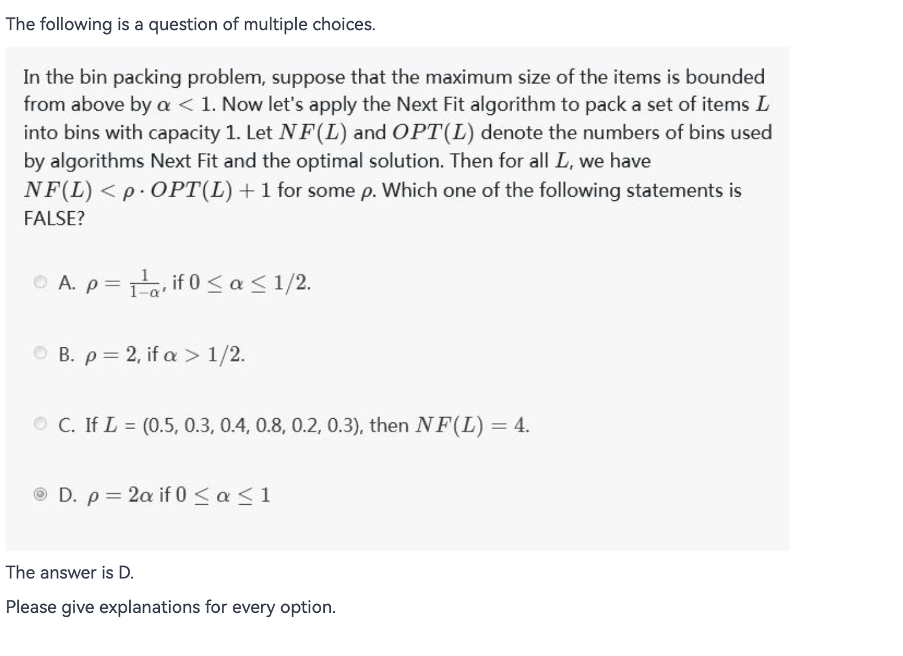

# Discussion

!!! abstract
    本部分用以记录陈越老师班级每周的讨论题。

## Week 2

**1-1** When it would be optimal to prefer Red-black trees over AVL trees?

**1-2** Please design an algorithm to adjust the structure of a red-black tree from top-down during an insertion.  That is, after inserting the node, we should no longer have to make any rotation.

**1-3** When to prefer B+ trees over B-trees?

## Week 3

**1-1** How to balance/select the precision or recall during relevance measurement? Please make your point by discussing some examples.

**1-2** What are the disadvantages of inverted file index technology?

## Week 4

**1-1** **Self-adjusting data structures**

In typical applications of data structures, it is not a single operation that is performed, but rather a sequence of operations, and the relevant complexity measure is not the time taken by one operation but the total time of a sequence.

If we are content with a data structure that is efficient in only an amortized sense, there is another way to obtain efficiency. Instead of imposing any explicit structural constraint, we allow the data structure to be in an arbitrary state, and we design the access and update algorithms to adjust the structure in a simple, uniform way, so that the efficiency of future operations is improved. We call such a data structure self-adjusting.

What are the pros and cons of self-adjusting data structures?

**1-2** For a skew heap, please construct a sequence of operations in which some operations take O(n) time.

## Week 5

**1-1** Please compare the performance of BuildHeap with leftist heaps and binomial queues.

**1-2** What if we simply use some normal tree for heaps without restriction of two child?  For the union procedure why don't we just make one heap the left child of the other heap?

**1-3** We have learnt the 2-3-4 B+tree in which the internal node (other than possibly the root) has two, three, or four children and all leaves have the same depth. In this problem, we shall implement 2-3-4 heaps, which support the mergeable-heap operations.  

The 2-3-4 heaps differ from 2-3-4 trees in the following ways:  

- In 2-3-4 heaps, only leaves store keys, and each leaf $x$ stores exactly one key in the field `key[x]`.  
- There is no particular ordering of the keys in the leaves; that is, from left to right, the keys may be in any order.  
- Each internal node $x$ contains a value `small[x]` that is equal to the smallest key stored in any leaf in the subtree rooted at $x$.  
- The root $r$ contains a field `height [r]` that is the height of the tree.  

Finally, 2-3-4 heaps are intended to be kept in main memory, so that disk reads and writes are not needed.  

Implement the following 2-3-4 heap operations. Each of the operations in parts (a)-(e) should run in $O(log n)$ time on a 2-3-4 heap with $n$ elements. The `UNION` operation in part (f) should run in $O(log n)$ time, where $n$ is the number of elements in the two input heaps.  

- (a) `MINIMUM`, which returns a pointer to the leaf with the smallest key.  
- (b) `DECREASE-KEY`, which decreases the key of a given leaf $x$ to a given value k ≤ `key[x]`.  
- \(c) `INSERT`, which inserts leaf $x$ with key $k$.  
- (d) `DELETE`, which deletes a given leaf $x$.  
- (e) `EXTRACT-MIN`, which extracts the leaf with the smallest key.  
- (f) `UNION`, which unites two 2-3-4 heaps, returning a single 2-3-4 heap and destroying the input heaps.

## Week 6

**1-1** When solving the Turnpike Reconstruction Problem, in Step 3 we always find the next "largest" distance and check.  How about finding the next “smallest” distance and check?

**1-2** How would you design the evaluation function for Gobang （五子棋）?

## Week 7

**1-1** Three-way-mergesort : Suppose instead of dividing in two halves at each step of the mergesort, we divide into three one thirds, sort each part, and finally combine all of them using a three-way-merge. 

What is the overall time complexity of this algorithm for sorting n elements?  Prove it.

How about k-way merge?

**1-2** Please show an example of how a problem can be partitioned into sub-problems, yet divide and conquer method does not work.

## Week 8

**1-1** Dijkstra’s Algorithm for solving the shortest path problem is generally viewed as a greedy algorithm.

Please try to provide a dynamic programming perspective on this algorithm.

**1-2** When solving the problem All-Pairs Shortest Path by Floyd method, if we change the order of iterations to i, k, j, while other codes remain unchanged (as shown below), can we still get the correct answer?

```c
for( i = 0; i < N; i++ ) 
    for( k = 0; k < N; k++ ) 
        for( j = 0; j < N; j++ ) 
            if( D[ i ][ k ] + D[ k ][ j ] < D[ i ][ j ] ) 
                D[ i ][ j ] = D[ i ][ k ] + D[ k ][ j ]; 
```

**1-3** Can we use recursions (as we do in dfs) to solve a problem via dynamic programming?  Please explain your answer by analyzing an example.

## Week 9

**1-1** Let us consider the following problem: given the set of activities S, we must schedule them all using the minimum number of rooms.

**Greedy1:** Use the optimal algorithm for the Activity Selection Problem to find the max number of activities that can be scheduled in one room. Delete and repeat on the rest, until no activity is left.

**Greedy2:**

- Sort activities by start time. Open room 1 for a1​.
- for i=2 to n if ai​ can fit in any open room, schedule it in that room; otherwise open a new room for ai​.

Discuss on each of the above algorithms -- will they end up at the optimal solution?

**1-2** Is Huffman algorithm the only way to obtain the optimal codes?  Prove it if your answer is YES, or show a counter-example if NO.

## Week 10

**1-1** The longest Hamiltonian cycle problem is to find a simple cycle of maximum length in a graph.  To prove that it is NPC, we must first prove that it is in NP -- that is, to prove that an answer can be verified to be correct in polynomial time.

To verify that a cycle is Hamiltonian is easy. But how would you know if a cycle really is the longest?

## Week 11

**1-1** 

{.center}

**1-2** The FFD algorithm for bin packing achieves the following bounds:
FFD(L)≤(11/9)OPT(L)+1, for all L.

- (1) Please show that FFD(L)≤(3/2)OPT(L), for all L, with the above inequality.

- (2) Prove that the factor 3/2 is the best possible unless P=NP (note that deciding if two bins are sufficient to accommodate a set of items is NP-complete).

**1-3** let's take another look at the fractional knapsack problem.  It can be shown that there is an optimal packing with at most one split item. Based on this observation, the 2-approximation algorithm for the 0-1 knapsack problem follows easily. Obviously, in the fractional case, if the split item has a relatively small value, it would result a good approximation for the integral case by simply discarding the split one (the items remain in the knapsack are all integral). 

Along this line, try to design a better approximation algorithm by bounding value of the split item (to be discarded later).

## Week 12

**1-1** What are the differences between Greedy algorithm and Local Search?

**1-2** A bipartite graph G is one whose vertex set can be partitioned into two sets A and B, such that each edge in the graph goes between a vertex in A and a vertex in B. Matching M in G is a set of edges that have no end points in common. Maximum Bipartite Matching Problem finds a matching with the greatest number of edges (over all matchings).

Consider the following **Gradient Ascent Algorithm**:

_As long as there is an edge whose endpoints are unmatched, add it to the current matching. When there is no longer such an edge, terminate with a locally optimal._

- (a) Give an example of a bipartite graph G for which this gradient ascent algorithm does **not** return the maximum matching.

- (b) Let M and M′ be matchings in a bipartite graph G. Suppose that ∣M′∣>2∣M∣. Show that there is an edge e′ in M′ such that (M∪e′) is a matching in G.

- \(c) Use (b) to conclude that any locally optimal matching returned by the gradient ascent algorithm in a bipartite graph G is at least half as large as a maximum matching in G.

## Week 13

**1-1** A Las Vegas algorithm is a randomized algorithm that always gives the correct result, however the runtime of a Las Vegas algorithm differs depending on the input. 

A Monte Carlo algorithm is a randomized algorithm whose output may be incorrect with a certain (typically small) probability. The running time for the algorithm is fixed however.

Which one is better?

What is the relationship between them?

**1-2** Let's consider the **Randomized Quicksort** where each pivot is randomly chosen from the subsequence. The following is the pseudo-code:

```c
RandQSort( A, L, R ) {
    if (L < R) {
        i = random(L, R);
        swap(A[i], A[R]);
        p = Partition(A, L, R);
        RandQSort( A, L, p-1 );
        RandQSort( A, p+1, R );
    }
}
```

Show that the **expected** running time is O(nlogn) for sorting A[1⋯n].

Hint: `Partition` is called n times. Each call takes a constant time plus the number of comparisons with the pivot. Hence the total run time is O(n+X) where X is the total number of comparisons with the pivots. You need to prove that E[X]=O(nlogn).

**1-3** Given a 3-SAT formula with k clauses, in which each clause has three variables, the **MAX 3-SAT** problem is to find a truth assignment that satisfies as many clauses as possible. A simple randomized algorithm is to flip a coin, and to set each variable true with probability 1/2, independently for each variable.

Prove that the expected number of clauses satisfied is 7k/8. Hence if we repeatedly generate random truth assignments until one of them satisfies ≥7k/8 clauses, then this algorithm is a 8/7-approximation algorithm.

## Week 14

**1-1** Please prove that a parallel algorithm with workload W and depth D can be implemented in W/p+D time using p processors for any p>0.

**1-2** Given a linked list of n elements which are stored in an array A of size n.  Each element, except one (to be called last), has a pointer to its successor in the list; also, each element, except one (to be called first), is the successor of exactly one element in the list. 

Define rank(i) as follows: for each i, rank(i)=0 if next(i)=NIL (or “end-of-list”) and rank(i)=rank(next(i))+1 otherwise. 

The task is to compute rank(i) for every i.  Please design a linear time serial algorithm; and design a parallel algorithm for solving the problem.  Please analyse the complexities.