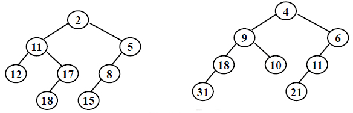
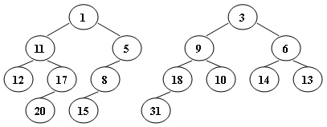
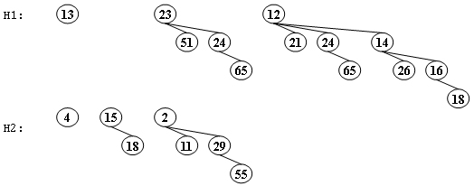
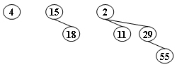
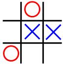

# Homework

!!! abstract 
    本部分用以记录每周发布在 PTA 上作业题的客观题，部分题目 ~~看我心情~~ 会写解析。

## Homework 1

**2-1** Insert 2, 1, 4, 5, 9, 3, 6, 7 into an initially empty AVL tree.  Which one of the following statements is FALSE?

- A. 4 is the root

- B. 3 and 7 are siblings

- C. 2 and 6 are siblings

- D. 9 is the parent of 7

**2-2** For the result of accessing the keys 3, 9, 1, 5 in order in the splay tree in the following figure, which one of the following statements is FALSE?

{.center}

- A. 5 is the root

- B. 1 and 9 are siblings

- C. 6 and 10 are siblings

- D. 3 is the parent of 4

**2-3** If the depth of an AVL tree is 6 (the depth of an empty tree is defined to be -1), then the minimum possible number of nodes in this tree is:

- A. 13

- B. 17

- C. 20

- D. 33

**2-4** When doing amortized analysis, which one of the following statements is FALSE?

- A. Aggregate analysis shows that for all $n$, a sequence of $n$ operations takes worst-case time $T(n)$ in total.  Then the amortized cost per operation is therefore $T(n)/n$

- B. For potential method, a good potential function should always assume its maximum at the start of the sequence

- C. For accounting method, when an operation's amortized cost exceeds its actual cost, we save the difference as credit to pay for later operations whose amortized cost is less than their actual cost

- D. The difference between aggregate analysis and accounting method is that the later one assumes that the amortized costs of the operations may differ from each other

**2-5** Consider the following buffer management problem. Initially the buffer size (the number of blocks) is one. Each block can accommodate exactly one item. As soon as a new item arrives, check if there is an available block. If yes, put the item into the block, induced a cost of one. Otherwise, the buffer size is doubled, and then the item is able to put into. Moreover, the old items have to  be moved into the new buffer so it costs $k+1$ to make this insertion, where $k$ is the number of old items. Clearly, if there are $N$ items, the worst-case cost for one insertion can be $\Omega (N)$.  To show that the average cost is $O(1)$, let us turn to the amortized analysis. To simplify the problem, assume that the buffer is full after all the $N$ items are placed. Which of the following potential functions works?

- A. The number of items currently in the buffer

- B. The opposite number of items currently in the buffer

- C. The number of available blocks currently in the buffer

- D. The opposite number of available blocks in the buffer


## Homework 2

**1-1** A 2-3 tree with 3 nonleaf nodes must have 18 keys at most.

- T

- F

**2-1** In the red-black tree that results after successively inserting the keys 41; 38; 31; 12; 19; 8 into an initially empty red-black tree, which one of the following statements is FALSE?

- A. 38 is the root

- B. 19 and 41 are siblings, and they are both red

- C. 12 and 31 are siblings, and they are both black

- D. 8 is red

**2-2** After deleting 15 from the red-black tree given in the figure, which one of the following statements must be FALSE?

{.center}

- A. 11 is the parent of 17, and 11 is black

- B. 17 is the parent of 11, and 11 is red

- C. 11 is the parent of 17, and 11 is red

- D. 17 is the parent of 11, and 17 is black

**2-3** Insert 3, 1, 4, 5, 9, 2, 6, 8, 7, 0 into an initially empty 2-3 tree (with splitting).  Which one of the following statements is FALSE?

- A. 7 and 8 are in the same node

- B. the parent of the node containing 5 has 3 children

- C. the first key stored in the root is 6

- D. there are 5 leaf nodes

**2-4** After deleting 9 from the 2-3 tree given in the figure, which one of the following statements is FALSE?

{.center}

- A. the root is full

- B. the second key stored in the root is 6

- C. 6 and 8 are in the same node

- D. 6 and 5 are in the same node

**2-5** Which of the following statements concerning a B+ tree of order $M$ is TRUE?

- A. the root always has between 2 and $M$ children

- B. not all leaves are at the same depth

- C. leaves and nonleaf nodes have some key values in common

- D. all nonleaf nodes have between $\lceil M/2\rceil$ and $M$ children

## Homework 3

**1-1** In distributed indexing, document-partitioned strategy is to store on each node all the documents that contain the terms in a certain range.

- T

- F

**1-2** When evaluating the performance of data retrieval, it is important to measure the relevancy of the answer set.

- T

- F

**1-3** Precision is more important than recall when evaluating the explosive detection in airport security.   

- T

- F

**1-4** While accessing a term by hashing in an inverted file index, range searches are expensive.  

- T

- F

**2-1** When measuring the relevancy of the answer set, if the precision is high but the recall is low, it means that:

- A.most of the relevant documents are retrieved, but too many irrelevant documents are returned as well

- B.most of the retrieved documents are relevant, but still a lot of relevant documents are missed

- C.most of the relevant documents are retrieved, but the benchmark set is not large enough

- D.most of the retrieved documents are relevant, but the benchmark set is not large enough

**2-2** Which of the following is NOT concerned for measuring a search engine?

- A.How fast does it index

- B.How fast does it search

- C.How friendly is the interface

- D.How relevant is the answer set

**2-3** There are 28000 documents in the database. The statistic data for one query are shown in the following table. The recall is: __

|       |   Relevant    |   Irrelevant  |
| :---: |   :---:       |   :---:       |
| Retrieved |   4000    |   12000       |
| Not Retrieved |   8000|   4000        |

- A.14%

- B.25%

- C.33%

- D.50%

## Homework 4

**1-1** The result of inserting keys 1 to $2^k -1$ for any $k>4$ in order into an initially empty skew heap is always a full binary tree.

- T

- F

**1-2** The right path of a skew heap can be arbitrarily long. 

- T

- F

**2-1** Merge the two leftist heaps in the following figure.  Which one of the following statements is FALSE?

{.center}

- A.2 is the root with 11 being its right child

- B.the depths of 9 and 12 are the same

- C.21 is the deepest node with 11 being its parent

- D.the null path length of 4 is less than that of 2

**2-2** We can perform BuildHeap for leftist heaps by considering each element as a one-node leftist heap, placing all these heaps on a queue, and performing the following step: Until only one heap is on the queue, dequeue two heaps, merge them, and enqueue the result.  Which one of the following statements is FALSE?

- A.in the $k$-th run, $\lceil N/2^k \rceil$ leftist heaps are formed, each contains $2^k$ nodes

- B.the worst case is when $N=2^K$ for some integer $K$

- C.the time complexity $T(N) = O(\frac{N}{2}log 2^0 + \frac{N}{2^2}log 2^1 + \frac{N}{2^3}log 2^2 + \cdots + \frac{N}{2^K}log 2^{K-1})$ for some integer $K$ so that $N=2^K$

- D.the worst case time complexity of this algorithm is $\Theta (NlogN)$

**2-3** Insert keys 1 to 15 in order into an initially empty skew heap.  Which one of the following statements is FALSE?

- A.the resulting tree is a complete binary tree

- B.there are 6 leaf nodes

- C.6 is the left child of 2

- D.11 is the right child of 7

**2-4** Merge the two skew heaps in the following figure.  Which one of the following statements is FALSE?

{.center}

- A.15 is the right child of 8

- B.14 is the right child of 6

- C.1 is the root

- D.9 is the right child of 3

**5-1** **Merge two leftist heaps**

The function is to merge two leftist heaps H1 and H2.

```c
PriorityQueue Merge( PriorityQueue H1, PriorityQueue H2 )
{ 
  if (H1==NULL) return H2;
  if (H2==NULL) return H1;
  if ( ) (3 分)
    swap(H1, H2);  //swap H1 and H2
  if ( H1->Left == NULL )
    ( ) (3 分)
  else {
    H1->Right = Merge( H1->Right, H2 );
    if ( H1->Left->Npl < H1->Right->Npl )
        SwapChildren( H1 );  //swap the left child and right child of H1
        ( ) (3 分)
  }
  return H1;
}
```
<!-- ??? note "solution"
    1. H1->Element > H2->Element
    2. H1->Left = H2
    3. H1->Npl = H1->Right->npl + 1 -->

## Homework 5

**2-1** Which of the following binomial trees can represent a binomial queue of size 42?

- A.$B_0$ $B_1$ $B_2$ $B_3$ $B_4$ $B_5$

- B.$B_1$ $B_3$ $B_5$

- C.$B_1$ $B_5$

- D.$B_2$ $B_4$

**2-2** For a binomial queue, __ takes a constant time on average.

- A.merging

- B.find-max

- C.delete-min

- D.insertion

**2-3** Merge the two binomial queues in the following figure.  Which one of the following statements must be FALSE?

{.center}

- A.there are two binomial trees after merging, which are $B_2$ and $B_4$

- B.13 and 15 are the children of 4

- C.if 23 is a child of 2, then 12 must be another child of 2

- D.if 4 is a child of 2, then 23 must be another child of 2

**2-4** Delete the minimum number from the given binomial queues in the following figure.  Which one of the following statements must be FALSE?

{.center}

- A.there are two binomial trees after deletion, which are $B_1$ and $B_2$

- B.11 and 15 can be the children of 4

- C.29 can never be the root of any resulting binomial tree

- D.if 29 is a child of 4, then 15 must be the root of $B_1$

**5-1** **BinQueue_Find**

The functions BinQueue_Find and Recur_Find are to find X in a binomial queue H.  Return the node pointer if found, otherwise return NULL.

```c
BinTree BinQueue_Find( BinQueue H, ElementType X )
{
    BinTree T, result = NULL;
    int i, j; 

    for( i=0, j=1; j<=H->CurrentSize; i++, j*=2) {  /* for each tree in H */
        T= H->TheTrees[i];
        if ( X ( )(2 分) ){  /* if need to search inside this tree */
            result = Recur_Find(T, X);
            if ( result != NULL ) return result;
        } 
    }
    return result;
}

BinTree Recur_Find( BinTree T, ElementType X )
{
    BinTree result = NULL;
    if ( X==T->Element ) return T;
    if ( T->LeftChild!=NULL ){
        result = Recur_Find(T->LeftChild, X);
        if ( result!=NULL ) return result;
    } 
    if ( ( )(2 分) )
        result = Recur_Find(T->NextSibling, X);
    return result;
}
```

## Homework 6

**2-1** In the Tic-tac-toe game, a "goodness" function of a position is defined as $f(P) = W_{computer} - W_{human}$where $W$ is the number of potential wins at position $P$.In the following figure, O represents the computer and X the human. What is the goodness of the position of the figure?

{.center}

- A.-1

- B.0

- C.4

- D.5

??? note "Solution"
    正确答案：B

    这里对 potential wins 的定义为当前局面下所有可能取胜的线路，因此 $W_{\text{computer}} = 3$，$W_{\text{human}} = 3$，故 $f(P) = 3 - 3 = 0$。

**2-2** Given the following game tree, which node is the first one to be pruned with α-β pruning algorithm?

{.center}

- A.a

- B.b

- C.c

- D.d

## Homework 7

**2-1** When solving a problem with input size $N$ by divide and conquer, if at each stage the problem is divided into 8 sub-problems of equal size $N/3$, and the conquer step takes $O(N^2 logN)$ to form the solution from the sub-solutions, then the overall time complexity is __.

- A.$O(N^2 logN)$

- B.$O(N^2 log^2 N)$

- C.$O(N^3 logN)$

- D.$O(N^{log8/log3})$

**2-2** To solve a problem with input size $N$ by divide and conquer algorithm, among the following methods, __ is the worst.

- A.divide into 2 sub-problems of equal complexity $N/3$ and conquer in $O(N)$

- B.divide into 2 sub-problems of equal complexity $N/3$ and conquer in $O(NlogN)$

- C.divide into 3 sub-problems of equal complexity $N/2$ and conquer in $O(N)$

- D.divide into 3 sub-problems of equal complexity $N/3$ and conquer in $O(NlogN)$

**2-3** 3-way-mergesort : Suppose instead of dividing in two halves at each step of the mergesort, we divide into three one thirds, sort each part, and finally combine all of them using a three-way-merge.  What is the overall time complexity of this algorithm ?

- A.$O(n(\log^2 n))$

- B.$O(n^2 \log n)$

- C.$O(n\log n)$

- D.$O(n)$

**2-4** Which one of the following is the lowest upper bound of $T(n)$ for the following recursion  $T(n) = 2T(\sqrt{n}) + \log n$?

- A.$O(\log n\log \log n)$

- B.$O(\log^2 n)$

- C.$O(n\log n)$

- D.$O(n^2)$

## Homework 8

**2-1** Rod-cutting Problem: Given a rod of total length $N$ inches and a table of selling prices $P_L$ for lengths $L = 1, 2, \cdots , M$.  You are asked to find the maximum revenue $R_N$ obtainable by cutting up the rod and selling the pieces.  For example, based on the following table of prices, if we are to sell an 8-inch rod, the optimal solution is to cut it into two pieces of lengths 2 and 6, which produces revenue $R_8 = P_2 +P_6 = 5+17 = 22$.  And if we are to sell a 3-inch rod, the best way is not to cut it at all.

|Length L|1|2|3|4|5|6|7|8|9|10|
|:--|:--|:--|:--|:--|:--|:--|:--|:--|:--|:--|
|Price PL​|1|5|8|9|10|17|17|20|23|28|

Which one of the following statements is FALSE?

- A.This problem can be solved by dynamic programming

- B.The time complexity of this algorithm is $O(N^2)$

- C.If $N\le M$, we have $R_N = \max \lbrace P_N , \max_{1\le i < N} \lbrace R_i + R_{N-i} \rbrace \rbrace$

- D.If $N>M$, we have $R_N = \max_{1\le i < N} \lbrace R_i + R_{N-M} \rbrace$

??? note "Solution"
    正确答案：D

    显然可以应用动态规划求解，写出递推关系式：

    $$
    \text{if} \; N > M, R_N = \max_{1 \leq i < N} \lbrace R_i + R_{N-i} \rbrace \\[1.5em]
    \text{if} \; N \leq M, R_N = \max \lbrace P_N , \max_{1\le i < N} \lbrace R_i + R_{N-i} \rbrace \rbrace
    $$

    可知 D 错误。错误的点在于不应将 $N - M$ 单独作为递归的一种子结构，这忽略了其它潜在的切割策略。

**2-2** In dynamic programming, we derive a recurrence relation for the solution to one subproblem in terms of solutions to other subproblems. To turn this relation into a bottom up dynamic programming algorithm, we need an order to fill in the solution cells in a table, such that all needed subproblems are solved before solving a subproblem. Among the following relations, which one is impossible to be computed?

- A.$A(i, j) = min (A(i-1,j), A(i,j-1), A(i-1,j-1))$

- B.$A(i, j) = F(A(min\{i, j\} - 1, min\{i, j\} - 1), A(max\{i, j\} - 1, max\{i, j\} -1))$

- C.$A(i, j) = F(A(i, j -1), A(i - 1, j - 1), A(i - 1, j + 1))$

- D.$A(i,j) = F(A(i-2, j-2), A(i+2,j+2))$

??? note "Solution"
    正确答案：D

    前三者都有可行的计算顺序，例如 A 可以用 外层 i 内层 j 的双层循环完成；B 只依赖于主对角线上的元素 $A(k, k)$，可以先算出所有的主对角线元素，之后所有 $A(i, j)$ 的值都可计算；C 类似于 A；但 D 选项中 $A(i, j)$ 与 $A(i+2, j+2)$ 相互依赖，不可计算。

**2-3** Given a recurrence equation $f_{i,j,k} =f_{i,j+1,k}+\min_{0 \le l \le k}\{f_{i-1,j,l}+w_{j,l}\}$. To solve this equation in an iterative way, we cannot fill up a table as follows:

- A.`for k in 0 to n: for i in 0 to n: for j in n to 0`

- B.`for i in 0 to n: for j in 0 to n: for k in 0 to n`

- C.`for i in 0 to n: for j in n to 0: for k in n to 0`

- D.`for i in 0 to n: for j in n to 0: for k in 0 to n`

??? note "Solution"
    正确答案：B

    根据递推式，$f_{i,j,k}$ 依赖于 $f_{i,j+1,k}$ 与 $f_{i-1,j,l}$，为保证 `i - 1` 与 `j + 1` 在 `i` 与 `j` 之前计算完毕，`i` 循环的顺序应为 `0 - n`，`j` 应为 `n - 0`，`k` 的顺序在这里不会影响结果。因此 B 选项是错误的。 

## Homework 9

**1-1** Let S be the set of activities in Activity Selection Problem.  Then the earliest finish activity $a_m$ must be included in all the maximum-size subset of mutually compatible activities of S.  

- T

- F

**1-2** Let $C$ be an alphabet in which each character $c$ in $C$ has frequency $c.freq$.  If the size of $C$ is $n$,  the length of the optimal prefix code for any character $c$ is not greater than $n-1$.   

- T

- F

**2-1** Consider the problem of making change for $n$ cents using the fewest number of coins. Assume that each coin's value is an integer.The coins of the lowest denomination（面额） is the cent.

(I) Suppose that the available coins are quarters (25 cents), dimes (10 cents), nickels (5 cents), and pennies (1 cent). The greedy algorithm always yields an optimal solution.

(II) Suppose that the available coins are in the denominations that are powers of c, that is, the denominations are $c^0$, $c^1$, ..., $c^k$ for some integers $c>1$ and $k>=1$. The greedy algorithm always yields an optimal solution.

(III) Given any set of $k$ different coin denominations which includes a penny (1 cent) so that there is a solution for every value of $n$, greedy algorithm always yields an optimal solution.

Which of the following is correct?

- A.Statement (I) is false.

- B.Statement (II) is false.

- C.Statement (III) is false.

- D.All of the three statements are correct.

??? note "Solution"
    正确答案：C

    前两种情况下，较大面额的硬币可以被较小面额的硬币精确表示，贪心总是局部最优的，因此是正确的；第三种情况下则不一定成立，例如我们有 1, 20, 50 三种面额的硬币，需要表示 60，此时最优策略应该是 20 × 3，而不是贪心所得的 50 + 10 × 1。对于第三种情况我们应使用动规求解。