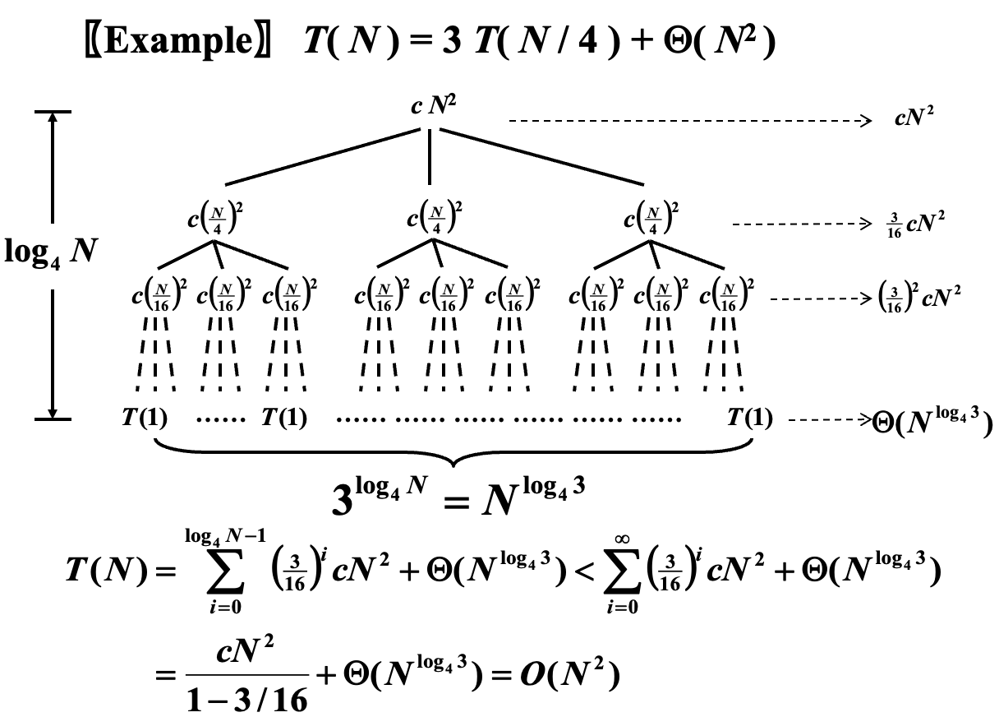

# Lecture 7: Divide & Conquer

分治法 (Divide and conquer algorithm) 属于一种算法范式，它的基本思想是将一个问题分解为若干个规模较小的相同问题，递归地解决这些子问题后将所有解合并得到原问题的解。本节将主要关注分治法时间复杂度的分析。

## 主定理

通常而言，分治法递归的时间复杂度递推公式具有以下形式：

$$ T(N) = aT(N/b) + f(N) $$

其中 a 是子问题的数量，b 与子问题划分方式有关，是子问题输入长度的收缩因子， $f(n)$ 是合并各个子问题的解所需的时间。为求解具有以上递推形式的算法的时间复杂度，我们通常有三种方法：

- 代入法 (Substitution Method)
- 递归树法 (Recursion-tree Method)
- 主定理法 (Master Method)

### 代入法

引用陈越老师 ppt 中的话，代入法其实就是 "guess, then prove by induction"，即猜证法，先猜测解的形式，后通过数学归纳法证明猜想的正确性。

=== "例题"

    $$ T(N) = 2T(\lfloor N/2 \rfloor) + N $$

=== "证明"

    假设 $ T(N) = O(N\log{N}) $  
    
    假设对任意 $ m < N $ 均满足猜想，令 $ m = \lfloor N/2 \rfloor $，则存在常数 $ c > 0 $，使得 $ T(\lfloor N/2 \rfloor) \leq c \lfloor N/2 \rfloor \log{\lfloor N/2 \rfloor} $.  

    代回原式，有  

    $$ 
    \begin{aligned}
    T(N) 
    &= 2T(\lfloor N/2 \rfloor) + N \\
    &\leq 2c\lfloor N/2 \rfloor \log{\lfloor N/2 \rfloor} + N \\
    &\leq cN(\log{N} - \log{2}) + N \\
    &\leq cN\log{N}
    \end{aligned}
    $$

=== "错误示例"

    若假设 $ T(N) = O(N) $

    以同样的方式，我们可以得到 $ T(\lfloor N/2 \rfloor) \leq c\lfloor N/2 \rfloor $

    代回原式，有  

    $$
    \begin{aligned}
    T(N)
    &= 2T(\lfloor N/2 \rfloor) + N \\
    &\leq 2c\lfloor N/2 \rfloor + N \\
    &\leq cN + N \\
    &= O(N)
    \end{aligned}
    $$

    我们得到了错误的结论，这是由于归纳假设不够强，在归纳时得到的并非 exact form，即我们的目标是证明 $ T(N) = O(N) \leq cN $，而实际得到的是 $ T(N) \leq cN + N $，没有得到准确的界，因此证明是失败的。

当遇到上例中错误证明的问题时，可以通过修改假设，将其减去一个低阶的项，使得证明能够继续进行下去。在上例的错误证明中，由于结果中多余项的阶数与目标结果相同，我们并不能通过强化归纳假设而得到正确结果，这说明假设本身就是错误的。对例如 $ T(N) = 2T(\lfloor N/2 \rfloor) + 1 $ 的递推式，如果我们假设 $ T(N) = O(N) $，会得到 $ T(N) \leq cN + 1 $ 的结果，此时可以将假设修正为 $ T(N) = O(N) - d,\; (d = constant) $，从而有 $ T(N) = cN - 2d + 1 \leq cN - d $，显然当 $ d \geq 1 $ 时结果成立。同样地，在处理边界条件时需要一个足够大的 $ c $。

此外，在利用代入法证明时常用到换元法，以下题为例：

=== "例题"

    $$ T(N) = 2T(\lfloor \sqrt{N} \rfloor) + \log{N} $$

=== "证明"

    为方便起见，我们只考虑 $ \sqrt{N} $ 为整数的情形。令 $ M = \log{N} $，得到  

    $$ T(2^M) = 2T(2^{M/2}) + M $$

    再令 $ S(M) = T(2^M) $，则有 $ S(M) = 2S(M/2) + M $，问题转化为我们熟悉的归并排序的递推表达式，我们知道有 $ S(M) = O(M\log{M}) $，因此

    $$ T(N) = \log{N}\log{\log{N}} $$

### 递归树法

通过画出表达式的递归树对算法进行分析，其中树每一层的复杂度为合并复杂度，每个叶子的复杂度为 base case 的复杂度，对于足够小的规模的问题视作常数。下面结合 ppt 中的例子说明。

{.center}

此时 $a = 3,\; b = 4,\; f(N) = \Theta(N^2)$，即每次分为 3 个子问题，子问题的规模为 $N/4$，合并开销为 $\Theta(N^2)$。由于此例下分治的策略是相对均匀的，所以我们可以认为得到的是一个完美三叉树。ppt 下一页的例子中收缩因子不一致，导致两侧树高不相同，从而会带来新的问题，也引出了主定理法。

回到本例，显然树高为 $\log_4 N$，根记为 0，每个分治节点的 combine 开销已经标注在图的节点位置，横向箭头标记的是对该层所有节点的开销的求和。特别的，对于最底层即叶子层，它表示的是 conquer 部分的开销。于是我们可以根据下式的形式对其进行求和，得到图片中下方的式子。

$$
T(N) = ... = 
\underbrace{c\; N_{leaves}}_{conquer}
+ 
\underbrace{\sum_{node_i}^{non-leaf-nodes}f(N_{node_i})}_{combine}
$$

### 主定理法

考虑如下形式：

$$ T(N) = aT(N/b) + f(N), a \geq 1, b \geq 2 $$

**定理一**  

1. 若对于 $\varepsilon > 0$ 有 $f(N)=O(N^{\log_b{a}-\varepsilon})$，则 $T(N)=\Theta(N^{\log_b{a}})$;  
2. 若 $f(N)=\Theta(N^{\log_b{a}})$，那么 $T(N)=\Theta(N^{\log_b{a}}\log{N})$；  
3. 若对于 $\varepsilon > 0$ 有 $f(N)=\Omega(N^{\log_b{a}+\varepsilon})$,  且对于 $c < 1$ 和所有足够大的 $N$ 有 $af(N/b) \leq cf(N)$, 则 $T(N)=\Theta(f(N))$；

需要注意的是，这三种情况并没有覆盖 $f(N)$ 的全部可能性。1 和 2，2 和 3 之间都有一定间隙，如果 $f(N)$ 落在两个间隙之中，或者 3 所要求的正则条件 (regular condition) 不成立，就不能使用定理一求解递归式。

主定理的关键在于比较 $N^{\log_b{a}}$ 与 $f(N)$ 之间的关联，如果前者大，则前者 master 整个时间复杂度，所以时间复杂度就是 $T(N) = aT(N/b)$ 对应的复杂度，此时 $a$ 较大，导致递归树的分叉较多，树形较大，进而使得更大的复杂度落在叶子上；反之则后者 master 整个时间复杂度，为 $f(N)$ 级别的复杂度，此时以每一层的复杂度为主。

接下来的定理二实际上是定理一的推论：

**定理二**

1. 若对于 $\kappa < 1$ 有 $af(N/b) = \kappa f(N)$，则 $T(N) = \Theta(f(N))$；
2. 若对于 $\Kappa > 1$ 有 $af(N/b) = \Kappa f(N)$，则 $T(N) = \Theta(N^{\log_b{a}}) = \Theta(a^{\log_b{N}})$
3. 若 $af(N/b) = f(N)$，则 $T(N) = \Theta(f(N) \log_b N)$；

**定理三**

对于递推式

$$
\begin{aligned}
& T(N) = aT(N/b) + \Theta(N^k \log^p{N})
& a \geq 1, b > 1, k \geq 0, p \geq 0
\end{aligned}
$$

有

$$
T(N) = \left\{
    \begin{aligned}
        & O(N^{\log_b{a}}) & \text{if } a > b^{k} \\
        & O(N^k \log^{p+1}{N}) & \text{if } a = b^{k} \\
        & O(N^k \log^{p}{N}) & \text{if } a < b^{k}
    \end{aligned}
\right.
$$

定理三相较于定理一、二更强，可以求解 $a = b = 2$ 时前两者都不可行的递推式。该定理还有更强的表达：

**定理四**

对于递推式

$$
\begin{aligned}
& T(N) = aT(N/b) + \Theta(N^k \log^p{N})
& a \geq 1, b > 1, k \geq 0, p \in \mathbb{R}
\end{aligned}
$$

有

$$
T(N) = \left\{
    \begin{aligned}
        & \Theta(N^{\log_b{a}}) & \text{if } a > b^{k} \\
        & \Theta(N^k \log^{p+1}{N}) & \text{if } a = b^{k}, p > -1 \\
        & \Theta(N^k \log\log{N}) & \text{if } a = b^{k}, p = -1 \\
        & \Theta(N^k) & \text{if } a = b^{k}, p < -1 \\
        & \Theta(N^k \log^{p}{N}) & \text{if } a < b^{k}, p \geq 0 \\
        & \Theta(N^k) & \text{if } a < b^k, p < 0
    \end{aligned}
\right.
$$

## 分治法的应用

### 最大子序列和问题

### 最近点对问题

二维最近点对问题 (Closet Points Problem) 指的是给定平面上的 n 个点，找出其中距离最近的两个点。
