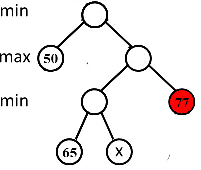

# 2025 - 2026 秋冬 期中考试卷

## 判断题

**R1-1** In the master method, we define $T(N)$ in the recursive form $T(N) = aT(N/b) + f(N)$. It means that the algorithm divides the problem into $a$ parts, with each part being $\frac{1}{b}$ the size of the original. It costs $f(N)$ to gather results from subproblems and to derive its own result.

- T

- F

**R1-2** In a B+ tree, leaves and nonleaf nodes have some key values in common. 

- T

- F

**R1-3** For one operation, if its worst-case time bound is $\Theta (log N)$, then its amortized time bound must be $O(log N)$. 

- T

- F

**R1-4** In the 4-queens problem, ($x_1$, $x_2$, $x_3$, $x_4$) correspond to the 4 queens'  column indices.  During backtracking, (1, 3, 4, ?) will be checked before (1, 4, 2, ?), and none of them has any solution in their branches.  

- T

- F

**R1-5** Precision is more important than recall when evaluating the cheating detection in Online Monitor System. 

- T

- F

**R1-6** In a red-black tree, an internal red node cannot be a node of degree 1.  

- T

- F

**R1-7** Given a connected graph $G=(V,E)$.  Let $A\subseteq V$ be any subset of $V$.  If $(u,v)\in E$ is an minimum edge connecting $A$ and $V-A$, then there exists an minimum spanning tree $T$ of $G$ such that $(u,v)\in T$.

- T

- F

**R1-8** While accessing a term stored in a B+ tree in an inverted file index, range searchings are expensive.

- T

- F

**R1-9** If a problem can be solved by dynamic programming, it must be solved in polynomial time. 

- T

- F

**R1-10** Insert { 11, 2, 45, 3, 8, 4, -1, 10, 128, -34, 15, 63, 18, 24, 86 } into an initially empty binomial queue, the resulting roots are 86, 24, -34 and -1. 

- T

- F

**R1-11** All of the Zig, Zig-zig, and Zig-zag rotations not only move the accessed node to the root, but also roughly half the depth of most nodes on the path.  

- T

- F

**R1-12** With the same operations, the resulting leftist heap is always more balanced than the skew heap. 

- T

- F

## 单选题

**R2-1** If there are 14 nodes in an AVL tree, then the maximum depth of the tree is ____. The depth of an empty tree is defined to be 0.

- A.3

- B.5

- C.4

- D.6

**R2-2** Delete the minimum number from the given leftist heap.  Which one of the following statements is TRUE?

{.center}

- A.23 is the left child of 14

- B.12 is the right child of 9

- C.37 is the left child of 23

- D.9 is NOT the root

**R2-3** Consider eight characters with the following frequencies. (We normalize the frequencies so that they sum to 1.)

|Symbol|Frequency|
|---|---|
|A|0.11|
|B|0.11|
|C|0.11|
|D|0.11|
|E|0.14|
|F|0.14|
|G|0.14|
|H|0.14|

What is the average encoding length of an optimal prefix code?

- A.3

- B.2.97

- C.2.87

- D.2.94

**R2-4** Given the following game tree, the red node will be pruned with α-β pruning algorithm if and only if ___.

{.center}

- A.$x\ge 50$

- B.$x\le 65$

- C.$65\le x\le 77$

- D.$x\ge 77$

**R2-5** When it would be optimal to prefer Red-black trees over AVL trees?

- A.when more search is needed

- B.when tree must be balanced

- C.when there are more insertions or deletions

- D.when $\log(n)$ time complexity is needed where $n$ is the number of nodes

**R2-6** For the result of accessing the keys 4 and 8 in order in the splay tree given in the figure, which one of the following statements is FALSE?

{.center}

- A.7 and 14 are siblings

- B.4 is the parent of 7

- C.8 is the root

- D.4 and 11 are siblings

**R2-7** Among the following groups of concepts, which group is not totally relevant to a search engine?

- A.stop words, posting list, dynamic indexing

- B.distributed index, hashing, inverted file index

- C.thresholding, dynamic programming, precision

- D.word stemming, compression, recall

**R2-8** When solving a problem with input size $N$ by divide and conquer, if at each step, the problem is divided into 9 sub-problems and each size of these sub-problems is $N/3$, and they are conquered in $O(N^2logN)$. Which one of the following is the closest to the overall time complexity?

- A.$O(N^2logN)$

- B.$O(N^2log^2N)$

- C.$O(N^2)$

- D.$O(N^3logN)$

**R2-9** A B+ tree of order 3 with 21 numbers has at most __ nodes of degree 3.

- A.2

- B.3

- C.1

- D.4

## 程序填空题

**R5-1** S1+S2=S

Given a string of $n$ characters $S=s_1s_2\cdots s_n$.  From $S$, $n_1$ characters are randomly chosen to form a sub-string $S_1=s_{i_1}s_{i_2}\cdots s_{i_{n_1}}$ with their original order kept (i.e., their subscripts satisfiy $1\le i_1<i_2<\cdots <i_{n_1}$).  It is easy to find the remaining $(n-n_1)$ characters which form another sub-string $S_2$, also keeping their original order.  Your job is to solve the reversed problem: determine whether two given sub-strings can be put together to obtain the original string $S$.

Given three strings S, S1 and S2, the function solve  is supposed to return 1 if merging S1 and S2 can obtain S, or 0 otherwise.  Please complete the following program. 

```c
int solve( char *S, char *S1, char *S2 )
{
    int dp[MAXN], L, L1, L2, i, j;

    L = strlen(S);
    L1 = strlen(S1);
    L2 = strlen(S2);
    if (L != (L1+L2)) return 0;
    dp[0] = 1;
    for (j=1; j<=L2; j++) {
        dp[j] = ( ); (3 分)
    }
    for (i=1; i<=L1; i++) {
        dp[0] = (S1[i-1]==S[i-1])&&dp[0];
        for (j=1; j<=L2; j++) {
            dp[j] = ( ); (3 分)
        }
    }
    return dp[L2];
}
```

**R5-2** Fill in B+ Tree

Given a B+ Tree of order odr, please calculate the maximum number of keys that can be inserted into the current tree root without causing any split operation.

```c
typedef struct BpTreeNode BpTreeNode;
struct BpTreeNode {
    BpTreeNode** childrens; /* Pointers to childrens. This field is not used by leaf nodes. */
    ElementType* keys;
    BpTreeNode* parent;
    bool isLeaf; /* 1 if this node is a leaf, or 0 if not */
    int numKeys; /* This field is used to keep track of the number of valid keys.*/
};
int odr;

int Solve(BpTreeNode * const root){
    BpTreeNode * node = root;
    if (node->isLeaf) {
        return ( ); (4 分)
    }
    int ans = 0;
    for(int i = 0; ( ); (4 分) i++) 
        ans += Solve(node->childrens[i]);
    return ans;
}

```

**R5-3** LR Rotation

The function LR_Rotation is to do left-right rotation to the trouble-finder tree node T in an AVL tree.

```c
typedef struct TNode *Tree;
struct TNode {
    int key, h;
    Tree left, right;
};

Tree LR_Rotation( Tree T )
{
    Tree K1, K2;

    K1 = T->left;    
    K2 = K1->right;
    ( ) (4 分)  = K2->left;
    ( ) (4 分)  = K2->right;
    K2->left = K1;
    ( ); (4 分)
    /* Update the heights */
    K1->h = maxh(Height(K1->left), Height(K1->right)) + 1;
    T->h = maxh(Height(T->left), Height(T->right)) + 1;
    K2->h = maxh(K1->h, T->h) + 1;

    return K2;
}
```

