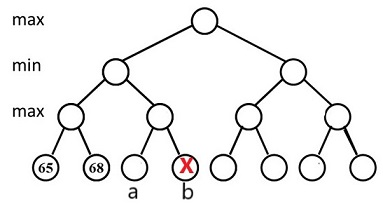

# Quiz

!!! abstract
    本部分用以记录陈越老师班级每周的课前 quiz 题。

## Week 2

**R1-1** In the worst case the DELETE operation in a RED-BLACK tree of $n$ nodes requires $\Omega (\log n)$ rotations.

- T

- F

**R1-2** When insert three keys into a non-empty 2-3 tree, and if the tree gains height when the first key is in, then it is possible that the 2-3 tree will gain more height after the insertions of the next two keys. 

- T

- F

**R1-3** When inserting a node into a red-black tree, we shall first insert the node as into an ordinary binary search tree, and then color the node black.

- T

- F

**R1-4** In a Red-Black tree, the path from the root to the farthest leaf is no more than twice as long as the path from the root to the nearest leaf.   

- T

- F

**R1-5** The following binary search tree is a valid red-black tree.

{.center}

- T

- F

**R1-6** In a red-black tree with 3 nodes, there must be a red node.

- T

- F

**R1-7** In a red-black tree with 2 nodes, there must be a red node.

- T

- F

**R1-8** The time bound of the FIND operation in a B+ tree containing $N$ numbers is $O(\log N)$, no matter what the degree of the tree is.

- T

- F

**R1-9** The root of a B+ tree of order $m$ has at most $m$ subtrees.

- T

- F

**R1-10** In a B+ tree, leaves and nonleaf nodes have some key values in common. 

- T

- F

## Week 3

**R1-1** In a search engine, thresholding for query retrieves the top $k$ documents according to their weights.  

- T

- F

**R1-2** When measuring the relevancy of the answer set, if the precision is high but the recall is low, it means that most of the relevant documents are retrieved, but too many irrelevant documents are returned as well.  

- T

- F

**R1-3** Precision measures the quality of all the retrieved documents.

- T

- F

**R1-4** While accessing a term stored in a B+ tree in an inverted file index, range searchings are expensive.

- T

- F

**R1-5** Word stemming is to eliminate the commonly used words from the original documents. 

- T

- F

**R1-6** Inverted file contains a list of pointers to all occurrences of a term in the text.

- T

- F

**R1-7** For the document-partitioned strategy in distributed indexing, each node contains a subset of all documents that have a specific range of index.

- T

- F

**R1-8** In general, comparing with the terms with short posting lists,  those with very long posting lists are less important. 

- T

- F

**R2-1** Which of the following is NOT a step in the process of building an inverted file index?

- A.Use stemming and stop words filter to obtain terms

- B.Read in strings and parse to get words

- C.Get the posting list for each term and calculate the precision

- D.Check dictionary with each term: if it is not in, insert it into the dictionary

**R2-2** Among the following groups of concepts, which group is not totally relevant to a search engine?

- A.posting list, thresholding, recall

- B.distributed index, backtracking, query

- C.inverted file index, stop words, precision

- D.word stemming, hashing, compression

## Week 4

**R1-1** In order to prove the amortized time bound for a skew heap, the potential function can be defined to be the number of right nodes of the resulting tree.

- T

- F

**R1-2** The relationship of skew heaps to leftist heaps is analogous to the relation between splay trees and AVL trees.

- T

- F

**R1-3** With the same operations, the resulting skew heap is always more balanced than the leftist heap. 

- T

- F

**R1-4** If we merge two heaps represented by complete binary trees, the time complexity is $\Theta(N)$ provided that the size of each heap is $N$.

- T

- F

**R1-5** A leftist heap with the null path length of the root being $r$ must have at least $2^{r+1}-1$ nodes.  

- T

- F

**R1-6** A skew heap is a heap data structure implemented as a binary tree. Skew heaps are advantageous because of their ability to merge more quickly than balanced binary heaps. The worst case time complexities for Merge, Insert, and DeleteMin are all $O(N)$, while the amorited time complexities for Merge, Insert, and DeleteMin are all $O(logN)$.  

- T

- F

**R1-7** The NPL of each node  in a heap is supposed to be calculated from top down.

- T

- F

**R2-1** Which one of the following statements is TRUE?

- A.{.center}
may be a leftist heap

- B.{.center}
may be a skew heap

- C.{.center}
may be a leftist heap

- D.{.center}
may be a leftist heap

**R2-2** Merge the two given skew heaps. Which one of the following statements is FALSE?

{.center}

- A.25 is the left child of 14

- B.17 is the right child of 16

- C.3 is the root

- D.39 is the right child of 25

**R2-3** Merge the two leftist heaps in the following figure.  Which one of the following statements is FALSE?

{.center}

- A.5 is the left child of 4

- B.the null path length of 6 is the same as that of 2

- C.1 is the root with 3 being its right child

- D.Along the left most path from top down, we have 1, 2, 6, and 8

## Week 5

**R1-1** To implement a binomial queue, left-child-next-sibling structure is used to represent each binomial tree.

- T

- F

**R1-2** For a binomial queue, delete-min takes a constant time on average. 

- T

- F

**R1-3** For a binomial queue, merging takes a constant time on average. 

- T

- F

**R1-4** Making $N$ insertions into an initally empty binomial queue takes $O(N)$ time in the worst case. 

- T

- F

**R1-5** Inserting a number into a binomial heap with 15 nodes costs less time than inserting a number into a binomial heap with 19 nodes. 

- T

- F

**R2-1** After inserting number 20 into a binomial queue of 6 numbers { 12, 13, 14, 23, 24, 35 }, which of the followings is impossible?

- A.the NextSibling link of node 14 may point to node 20

- B.the LeftChild link of node 12 may point to node 14

- C.the NextSibling link of the node 20 is NULL

- D.the LeftChild link of the node 20 is NULL

**R2-2** After deleting number 14 from a binomial queue of 5 numbers { 12, 13, 14, 23, 24 }, which of the followings is impossible?

- A.the LeftChild link of the node 12 is NULL;

- B.the LeftChild link of node 24 is NULL;

- C.the NextSibling link of node 13 may point to node 23;

- D.the NextSibling link of the node 12 is NULL;

**R2-3** The potential function $Q$ of a binomial queue is the number of the trees.  After merging two binomial queues $H1$ with 22 nodes and $H2$ with 13 nodes，what is the potential change $Q (H1+H2)-(Q (H1)+Q (H2))$ ?

- A.-3

- B.-2

- C.0

- D.2

**R5-1** **BinQueue_Insert**

The function BinQueue_Insert is to insert X into a binomial queue H, and return H as the result.

```C
BinQueue BinQueue_Insert( ElementType X, BinQueue H )
{
    BinTree Carry; 
    int i; 

    H->CurrentSize++;
    Carry = malloc( sizeof( struct BinNode ) );
    Carry->Element = X;
    Carry->LeftChild = Carry->NextSibling = NULL;

    i = 0;
    while ( H->TheTrees[i] ) { 
        Carry = CombineTrees( Carry, ( )(1 分) ); //combine two equal-sized trees
        H->TheTrees[i++] = NULL;
    }
    ( )(1 分);
    return  H;
}
```

## Week 6

**R1-1** In the 4-queens problem, ($x_1$, $x_2$, $x_3$, $x_4$) correspond to the 4 queens'  column indices.  During backtracking, (1, 4, 2, ?) will be checked before (2, 4, 1, ?), and none of them has any solution in their branches.  

- T

- F

**R1-2** What makes the time complexity analysis of a backtracking algorithm very difficult is that the number of solutions that do satisfy the restriction is hard to estimate.

- T

- F

**R1-3** It is guaranteed that an exhaustive search can always find the solution in finite time.

- T

- F

**R2-1** Given the following game tree, the red node will be pruned with α-β pruning algorithm if and only if __.

{.center}

- A.$x\geq9$

- B.$6 \leq x\leq9$

- C.$6 \leq x\leq13$

- D.$x\geq13$

**R2-2** Given the distance set D={1,1,2,2,2,2,3,3,3,4,5,5,6,6,8} in a Turnpike Reconstruction problem, first it can be sure that x1=0 and x6=8.  Which of the following possible solutions will be checked next?

- A.x2=2,  x5=6

- B.x2=1,  x5=5

- C.x2=1,  x5=6

- D.x3=3,  x5=6

**R2-3** Given the following game tree, if node b is pruned with α-β pruning algorithm, which of the following statements about the value of node a is correct?

{.center}

- A.less than 65

- B.greater than 65

- C.less than 68

- D.greater than 68

**R2-4** To solve the turnpike reconstruction problem with given distances {1,1,3,3,4,4,4,5,7,8},which of the following statements is true?

- A.x1=0, x3=4, x5=8

- B.x1=0, x2=1, x3=5

- C.x1=0, x2=3, x3=5

- D.x3=4, x4=6, x5=8

## Week 7

**R1-1** For the recurrence equation $T(N)=aT(N/b)+f(N)$, if $af(N/b)=Kf(N)$ for some constant $K>1$, then $T(N)=\Theta(f(N))$. 

- T

- F

**R1-2** If devide-and-conquer strategy is used to find the closest pair of points in a plane, unless the points are sorted not only by their $x$ coordinates but also by their $y$ coordinates, it would be impossible to solve it in a time of  $O(NlogN)$, where $N$ is the number of points.  

- T

- F

**R1-3** For the recurrence equation $T(N)=8T(N/2)+N^3logN$，we obtain $T(N)=O(N^3logN)$ according to the Master Theorem.

- T

- F

**R1-4** For the recurrence equation $T(N)=aT(N/b)+f(N)$, if $af(N/b)=f(N)$, then $T(N)=\Theta (f(N) log_b N)$. 

- T

- F

**R2-1** How many of the following sorting methods use(s) Divide and Conquer algorithm?  

- Candidate List:
    - Heap Sort
    - Insertion Sort
    - Merge Sort
    - Quick Sort
    - Selection Sort
    - Shell Sort

- A.2

- B.5

- C.4

- D.3

**R2-2** Suppose that the devide-and-conquer strategy is used to find the maximum and the minimum of $N$ positive numbers.  At each step, the problem is divided into 2 sub-problems of size $N/2$. Then the time recurrences is $T(N) = 2T(N/2)+f(N)$, where $f(N)$ is ____.

- A.$\Theta (logN)$

- B.$N/2$

- C.$O(1)$

- D.$\Omega (N)$

## Week 8

**R1-1** To solve a problem by dynamic programming instead of recursions, the key approach is to store the results of computations for the subproblems so that we only have to compute each different subproblem once.  Those solutions can be stored in an array or a hash table.  

- T

- F

**R1-2** The root of an optimal binary search tree always contains the key with the highest search probability. 

- T

- F

**R2-1** When solving the problem All-Pairs Shortest Path by Floyd method, which one of the following iterations can give us the correct answer?

- A.
```c
for( i = 0; i < N; i++ ) 
    for( k = 0; k < N; k++ ) 
        for( j = 0; j < N; j++ ) 
            if( D[ i ][ k ] + D[ k ][ j ] < D[ i ][ j ] ) 
                D[ i ][ j ] = D[ i ][ k ] + D[ k ][ j ]; 
```

- B.
```c
for( k = 0; k < N; k++ ) 
    for( i = 0; i < N; i++ ) 
        for( j = 0; j < N; j++ ) 
            if( D[ k ][ i ] + D[ i ][ j ] < D[ k ][ j ] ) 
                D[ k ][ j ] = D[ k ][ i ] + D[ i ][ j ]; 
```

- C.
```c
for( i = 0; i < N; i++ ) 
    for( k = 0; k < N; k++ ) 
        for( j = 0; j < N; j++ ) 
            if( D[ k ][ i ] + D[ i ][ j ] < D[ k ][ j ] ) 
                D[ k ][ j ] = D[ k ][ i ] + D[ i ][ j ]; 
```

- D.
```c
for( i = 0; i < N; i++ ) 
    for( j = 0; j < N; j++ ) 
        for( k = 0; k < N; k++ ) 
            if( D[ i ][ k ] + D[ k ][ j ] < D[ i ][ j ] ) 
                D[ i ][ j ] = D[ i ][ k ] + D[ k ][ j ]; 
```

**R2-2** Why doesn't Floyd algorithm work if there are negative-cost cycles?

- A.Because Floyd algorithm will fall into infinite loops.

- B.Because a negative-cost cycle will result in a negative D[i][i], yet Floyd algorithm can only accept positive weights.

- C.Because Floyd algorithm will terminate after finite steps, yet the shortest distance is negative infinity if there is a negative-cost cycle.

- D.Because Floyd didn't like negative numbers.

**R2-3** Which one of the following problems can be best solved by dynamic programming?

- A.Longest common subsequence problem

- B.Quicksort

- C.Closest pair of points problem

- D.Mergesort

**R2-4** To solve the optimal binary search tree problem, we have the recursive equation $c_{ij} = \min_{i \le l \le j} \{w_{ij} + c_{i,l-1}+c_{l+1,j}\}$. To solve this equation in an iterative way, we must fill up a table as follows:

- A.
```c
    for k= 1 to n-1 do;
      for i= 1 to n-k do;
         set j = i+k;
         for l= i to j do
```

- B.
```c
    for k= 1 to n-1 do;
      for i= 1 to n do;
         set j = i+k;
         for l= i to j do
```

- C.
```c
    for i= 1 to n-1 do;
      for j= i to n do;
        for l= i to j do
```

- D.
```c
   for j= 1 to n-1 do;
      for i= 1 to j do;
        for l= i to j do
```

**R2-5** We can tell that there must be a lot of redundant calculations during the exhaustive search for the matrix multiplication problem, because the search work load is the Catalan number, yet there are only ___ different sub-problems $M_{ij}$.

- A.$O(N^2)$

- B.$O(N^3)$

- C.$O(N)$

- D.$O(N^4)$

## Week 9

**R1-1** A binary tree that is not full cannot correspond to an optimal prefix code.

- T

- F

**R1-2** In a greedy algorithm, a decision made in one stage is not changed in a later stage.

- T

- F

**R1-3** Let $c_{1,j}$ be the optimal solution for $a_1$ to $a_j$, and $a_{k(j)}$ is the nearest compatible activity to $a_j$  that is finished before $a_j$.  If each activity has a weight $w$, then

{.center}

- T

- F

**R1-4** To prove the correctness of a greedy algorithm, we must prove that an optimal solution to the original problem always makes the greedy choice, so that the greedy choice is always safe. 

- T

- F

**R1-5** Greedy algorithm works only if the local optimum is equal to the global optimum. 

- T

- F

**R2-1** Given four characters (a, b, c, d) with distinct frequencies in a text.  Suppose that a and b are the two characters having the lowest frequencies.  Which of the following sets of code is a possible Huffman code for this text?

- A.a: 000,  b:001,  c:10,  d:1

- B.a: 010,  b:001,  c:01,  d:1

- C.a: 000,  b:001,  c:01,  d:11

- D.a: 000,  b:001,  c:01,  d:1

**R2-2** Given a set of activities $S = \{ a_1, a_2, \cdots , a_n \}$.  Each $a_i$ takes place during a time interval $[s_i, f_i)$.If an instance $S$ given as the following, the maximum-size  of mutually compatible activities is __.

{.center}

- A.7

- B.6

- C.5

- D.4

**R2-3** Given 4 cases of frequences of four characters. In which case(s) that the total bits taken by Huffman codes are the same as that of the ordinary equal length codes?

```
(1) 4 2 11 6
(2) 6 5 7 12
(3) 3 2 3 4
(4) 8 3 10 7
```

- A.(3) and (4)

- B.none

- C.(3) only

- D.(1) and (3)

