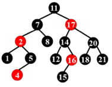

# Quiz

!!! abstract
    本部分用以记录陈越老师班级每周的课前 quiz 题。

## Week 2

**R1-1** In the worst case the DELETE operation in a RED-BLACK tree of $n$ nodes requires $\Omega (\log n)$ rotations.

- T

- F

**R1-2** When insert three keys into a non-empty 2-3 tree, and if the tree gains height when the first key is in, then it is possible that the 2-3 tree will gain more height after the insertions of the next two keys. 

- T

- F

**R1-3** When inserting a node into a red-black tree, we shall first insert the node as into an ordinary binary search tree, and then color the node black.

- T

- F

**R1-4** In a Red-Black tree, the path from the root to the farthest leaf is no more than twice as long as the path from the root to the nearest leaf.   

- T

- F

**R1-5** The following binary search tree is a valid red-black tree.

{.center}

- T

- F

**R1-6** In a red-black tree with 3 nodes, there must be a red node.

- T

- F

**R1-7** In a red-black tree with 2 nodes, there must be a red node.

- T

- F

**R1-8** The time bound of the FIND operation in a B+ tree containing $N$ numbers is $O(\log N)$, no matter what the degree of the tree is.

- T

- F

**R1-9** The root of a B+ tree of order $m$ has at most $m$ subtrees.

- T

- F

**R1-10** In a B+ tree, leaves and nonleaf nodes have some key values in common. 

- T

- F

## Week 3

**R1-1** In a search engine, thresholding for query retrieves the top $k$ documents according to their weights.  

- T

- F

**R1-2** When measuring the relevancy of the answer set, if the precision is high but the recall is low, it means that most of the relevant documents are retrieved, but too many irrelevant documents are returned as well.  

- T

- F

**R1-3** Precision measures the quality of all the retrieved documents.

- T

- F

**R1-4** While accessing a term stored in a B+ tree in an inverted file index, range searchings are expensive.

- T

- F

**R1-5** Word stemming is to eliminate the commonly used words from the original documents. 

- T

- F

**R1-6** Inverted file contains a list of pointers to all occurrences of a term in the text.

- T

- F

**R1-7** For the document-partitioned strategy in distributed indexing, each node contains a subset of all documents that have a specific range of index.

- T

- F

**R1-8** In general, comparing with the terms with short posting lists,  those with very long posting lists are less important. 

- T

- F

**R2-1** Which of the following is NOT a step in the process of building an inverted file index?

- A.Use stemming and stop words filter to obtain terms

- B.Read in strings and parse to get words

- C.Get the posting list for each term and calculate the precision

- D.Check dictionary with each term: if it is not in, insert it into the dictionary

**R2-2** Among the following groups of concepts, which group is not totally relevant to a search engine?

- A.posting list, thresholding, recall

- B.distributed index, backtracking, query

- C.inverted file index, stop words, precision

- D.word stemming, hashing, compression

