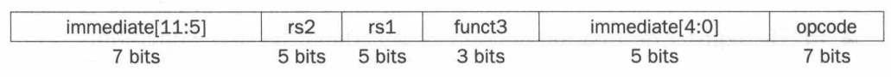

# Chapter 2: Instructions: Language of the Computer

## Operands of the Computer Hardware

在 RISC-V 体系结构中，寄存器的大小为 64 位，成组的 64 位被称为双字（double word）。另一个常见大小是成组的 32 位，在 RISC-V 体系结构中称为字（word）。

在当前的 RISC-V 等计算机上通常有 32 个寄存器，在本节中，我们限制 RISC-V 算术指令的三个操作数必须从 32 个 64 位寄存器中选择。

### Memory Operands 

如上所述，RISC-V 指令中的算术运算只作用于寄存器，为访问存储在内存中的数据， RISC-V 必须包含在内存和寄存器之间传输数据的指令，这些指令称为数据传输指令（data transfer instructions）。为访问内存中的字或双字，指令必须提供内存地址。

RISC-V 使用字节寻址，每个双字代表 8 个字节。同时，RISC-V 采用小端编址，即字的最低有效字节（least significant byte）在该字的最小地址处。另一种编址方式为大端编址，与小端编址相反。

将数据从内存复制到寄存器的数据传输指令通常称为载入指令（load）。与其相反的指令为存储指令（store），它从寄存器复制数据到内存。

例：有 C 语言代码 `A[12] = h + A[8];`，其中 h 存放在 x21 寄存器中，A 数组的基址寄存器为 x22，将其翻译为 RISC-V 汇编代码，为：

```asm
ld      x9, 64(x22)     // Temporary reg x9 gets A[8]
add     x9, x21, x9     // Temporary reg x9 gets h + A[8]
sd      x9, 96(x22)     // Store h + A[8] back into A[12]
```

其中存放基址的寄存器被称为基址寄存器（base register，也被称作下标寄存器），而数据传输指令中的常数称为偏移量（offset）。

许多程序有比寄存器更多的变量，因此，编译器会尽量将最常用的变量存放在寄存器中，剩下的存放在内存中，使用 load 和 store 在寄存器和内存之间传输变量，将不常用的变量存放到内存的过程称为寄存器换出（spilling）。这是由于内存比寄存器慢，并且在寄存器中的数据可以被 RISC-V 算术指令更高效地操作。

### Constant or Immediate Operands

程序在一次操作中经常用到常数，为避免使用加载指令，获得更快的操作速度与更低的能耗，RISC-V 提供带有一个常数操作数的快速加指令，称为立即数加或 `addi`。要将 4 加到寄存器 x22，可以写成：

```asm
addi    x22, x22, 4
```

RISC-V 中并没有与 `addi` 对应的 `subi` 指令，因为 immediate 字段表示的是二进制补码整数，因此 `addi` 可以用于做常数减法。

通过使用常数 0 可以简化指令系统体系结构，例如使用常 0 寄存器求原数的相反数。因此，RISC-V 专用寄存器 x0 硬连线到常数 0。

## Signed and Unsigned Numbers

计算机中使用二进制数位（binary digit，也称为位）作为信息的基本单位，二进制数计算的原子单位是单个数位。在 64 位双字中，从右向左依次将位编号为 0，1，2…… 最低有效位（least significang bit）指的是最右边的位，最高有效位（most significant bit）指的是最左边的位。

每一位都用于表示数的二进制数称为无符号数（unsigned number），显然对于一个 n 位的无符号数，其可表示范围为 $0 \sim 2^n - 1$。

为区分正数与负数，最显然的方法是添加一个单独的符号位来表示数的正负，这种表示方法称为原码（sign and magnitude）。我们认为这个符号位位于数的最高有效位，则其可表示范围为 $-(2^{n-1} - 1) \sim 2^{n-1} - 1$，此时系统中存在两种零的表示，即符号位分别为 0 或 1，剩余的数值为全 0 时，所表示的分别为正零和负零。

另一种有符号二进制数的表示方法为二进制补码（two's complement），其前导 0 表示正数，前导 1 表示负数。对于 n 位的二进制数，在补码表示法下规定其值为 $x = -x_{n-1} 2^{n-1} + x_{n-2} 2^{n-2} + \cdots + x_1 2^1 + x_0 2^0$，其表示范围为 $-2^{n-1} \sim 2^{n-1} - 1$。在补码表示法下，有 $x + \bar{x} + 1 = 0$，故求一个数的相反数可以通过对原数取反 + 1 完成。

此外，还有一种表示方法称作反码（one's complement），用 $10...00_2$ 表示最小负数，$01...11_2$ 表示最大正数，负数与正数的个数相等，且有两个零，一个正零（$00...00_2$）与一个负零（$11...11_2$）。在第三章讨论浮点数的表示时，有最后一种被称为偏移表示法（biased notation）的方法。它用 $00...00_2$ 表示最小负数，$11...11_2$ 表示最大负数，$10...00_2$ 表示零，这种表示方法通过给数加上偏移量得到一个非负表示形式。

## Instructions in the Computer

计算机识别的指令有特定的表示方式，这种指令的设计称作指令格式 (instruction format)，即由二进制数字字段组成的指令表示形式。在 RISC-V 中，指令的长度都为 32 位。将指令的数字称作机器语言（machine language），将这样的指令序列称作机器码（machine code）。

### RISC-V Fields

{.center}

以上图中的 R-type 指令（用于寄存器）为例，RISC-V 各个字段的含义分别为：

- opcode（操作码）：指令的基本操作
- rd：目的操作数寄存器，用于存放操作结果
- funct3：一个另外的操作码字段
- rs1：第一个源操作数寄存器
- rs2：第二个源操作数寄存器
- funct7：一个另外的操作码字段

另一种指令格式的类型为 I-type，用于带一个常数的算术指令以及加载指令，其字段如下图所示。其中 12 位的 immediate 字段为补码值。当 I-type 格式用于加载指令时，immediate 字段表示偏移量，因此加载双字指令可以取相对于基址寄存器 rd 中基地址偏移 $\pm (2^{11} \; \text{or} \; 2048)$ 字节的任何双字。

{.center}

对于存储双字指令 `sd`，它需要两个源寄存器（用于基址和存储数据）和一个用于偏移量的 immediate 字段。S-type 指令格式用于存储指令，其字段如下图所示：

{.center}

## Logical Operations

在一个字内对几个位构成的字段、甚至于单个位的操作是十分有效的，因此人们在编程语言和指令系统体系结构中添加了逻辑操作（logical operations）指令，用于简化打包或拆包。下图中为 C、Java 和 RISC-V 中的逻辑运算。

{.center}

