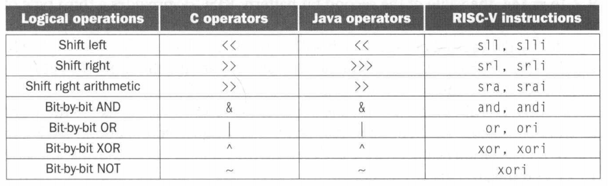
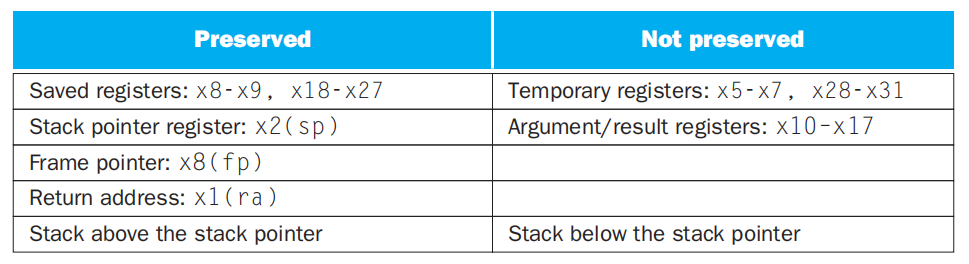
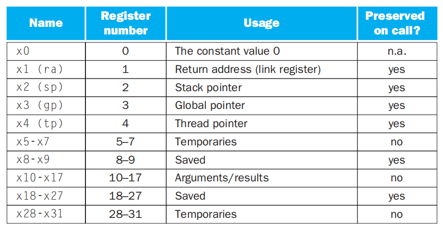

# Chapter 2: Instructions: Language of the Computer

## Operands of the Computer Hardware

在 RISC-V 体系结构中，寄存器的大小为 64 位，成组的 64 位被称为双字（double word）。另一个常见大小是成组的 32 位，在 RISC-V 体系结构中称为字（word）。

在当前的 RISC-V 等计算机上通常有 32 个寄存器，在本节中，我们限制 RISC-V 算术指令的三个操作数必须从 32 个 64 位寄存器中选择。

### Memory Operands 

如上所述，RISC-V 指令中的算术运算只作用于寄存器，为访问存储在内存中的数据， RISC-V 必须包含在内存和寄存器之间传输数据的指令，这些指令称为数据传输指令（data transfer instructions）。为访问内存中的字或双字，指令必须提供内存地址。

RISC-V 使用字节寻址，每个双字代表 8 个字节。同时，RISC-V 采用小端编址，即字的最低有效字节（least significant byte）在该字的最小地址处。另一种编址方式为大端编址，与小端编址相反。

将数据从内存复制到寄存器的数据传输指令通常称为载入指令（load）。与其相反的指令为存储指令（store），它从寄存器复制数据到内存。

=== "例题"
    有 C 语言代码 `A[12] = h + A[8];`，其中 h 存放在 x21 寄存器中，A 数组的基址寄存器为 x22，将其翻译为 RISC-V 汇编代码，为：

    ```asm
    ld      x9, 64(x22)     // Temporary reg x9 gets A[8]
    add     x9, x21, x9     // Temporary reg x9 gets h + A[8]
    sd      x9, 96(x22)     // Store h + A[8] back into A[12]
    ```

其中存放基址的寄存器被称为基址寄存器（base register，也被称作下标寄存器），而数据传输指令中的常数称为偏移量（offset）。

许多程序有比寄存器更多的变量，因此，编译器会尽量将最常用的变量存放在寄存器中，剩下的存放在内存中，使用 load 和 store 在寄存器和内存之间传输变量，将不常用的变量存放到内存的过程称为寄存器换出（spilling）。这是由于内存比寄存器慢，并且在寄存器中的数据可以被 RISC-V 算术指令更高效地操作。

### Constant or Immediate Operands

程序在一次操作中经常用到常数，为避免使用加载指令，获得更快的操作速度与更低的能耗，RISC-V 提供带有一个常数操作数的快速加指令，称为立即数加或 `addi`。要将 4 加到寄存器 x22，可以写成：

```asm
addi    x22, x22, 4
```

RISC-V 中并没有与 `addi` 对应的 `subi` 指令，因为 immediate 字段表示的是二进制补码整数，因此 `addi` 可以用于做常数减法。

通过使用常数 0 可以简化指令系统体系结构，例如使用常 0 寄存器求原数的相反数。因此，RISC-V 专用寄存器 x0 硬连线到常数 0。

## Signed and Unsigned Numbers

计算机中使用二进制数位（binary digit，也称为位）作为信息的基本单位，二进制数计算的原子单位是单个数位。在 64 位双字中，从右向左依次将位编号为 0，1，2…… 最低有效位（least significang bit）指的是最右边的位，最高有效位（most significant bit）指的是最左边的位。

每一位都用于表示数的二进制数称为无符号数（unsigned number），显然对于一个 n 位的无符号数，其可表示范围为 $0 \sim 2^n - 1$。

为区分正数与负数，最显然的方法是添加一个单独的符号位来表示数的正负，这种表示方法称为原码（sign and magnitude）。我们认为这个符号位位于数的最高有效位，则其可表示范围为 $-(2^{n-1} - 1) \sim 2^{n-1} - 1$，此时系统中存在两种零的表示，即符号位分别为 0 或 1，剩余的数值为全 0 时，所表示的分别为正零和负零。

另一种有符号二进制数的表示方法为二进制补码（two's complement），其前导 0 表示正数，前导 1 表示负数。对于 n 位的二进制数，在补码表示法下规定其值为 $x = -x_{n-1} 2^{n-1} + x_{n-2} 2^{n-2} + \cdots + x_1 2^1 + x_0 2^0$，其表示范围为 $-2^{n-1} \sim 2^{n-1} - 1$。在补码表示法下，有 $x + \bar{x} + 1 = 0$，故求一个数的相反数可以通过对原数取反 + 1 完成。

此外，还有一种表示方法称作反码（one's complement），用 $10...00_2$ 表示最小负数，$01...11_2$ 表示最大正数，负数与正数的个数相等，且有两个零，一个正零（$00...00_2$）与一个负零（$11...11_2$）。在第三章讨论浮点数的表示时，有最后一种被称为偏移表示法（biased notation）的方法。它用 $00...00_2$ 表示最小负数，$11...11_2$ 表示最大负数，$10...00_2$ 表示零，这种表示方法通过给数加上偏移量得到一个非负表示形式。

## Instructions in the Computer

计算机识别的指令有特定的表示方式，这种指令的设计称作指令格式 (instruction format)，即由二进制数字字段组成的指令表示形式。在 RISC-V 中，指令的长度都为 32 位。将指令的数字称作机器语言（machine language），将这样的指令序列称作机器码（machine code）。

### RISC-V Fields

<p style="margin:0;padding:0;line-height:0"></p>
<table class="riscv-table">
<tr>
    <td class="riscv-table-numnodel">31</td>
    <td class="riscv-table-numnode" colspan="5"></td>
    <td class="riscv-table-numnoder">25</td>
    <td class="riscv-table-numnodel">24</td>
    <td class="riscv-table-numnode" colspan="3"></td>
    <td class="riscv-table-numnoder">20</td>
    <td class="riscv-table-numnodel">19</td>
    <td class="riscv-table-numnode" colspan="3"></td>
    <td class="riscv-table-numnoder">15</td>
    <td class="riscv-table-numnodel">14</td>
    <td class="riscv-table-numnode" colspan="1"></td>
    <td class="riscv-table-numnoder">12</td>
    <td class="riscv-table-numnodel">11</td>
    <td class="riscv-table-numnode" colspan="3"></td>
    <td class="riscv-table-numnoder">7</td>
    <td class="riscv-table-numnodel">6</td>
    <td class="riscv-table-numnode" colspan="5"></td>
    <td class="riscv-table-numnoder">0</td>
</tr>
<tr>
    <td colspan="7" class="riscv-table-node">funct7</td>
    <td colspan="5" class="riscv-table-node">rs2</td>
    <td colspan="5" class="riscv-table-node">rs1</td>
    <td colspan="3" class="riscv-table-node">funct3</td>
    <td colspan="5" class="riscv-table-node">rd</td>
    <td colspan="7" class="riscv-table-node">opcode</td>
</tr>
<tr>
    <td colspan="7" class="riscv-table-undernode">7 bits</td>
    <td colspan="5" class="riscv-table-undernode">5 bits</td>
    <td colspan="5" class="riscv-table-undernode">5 bits</td>
    <td colspan="3" class="riscv-table-undernode">3 bits</td>
    <td colspan="5" class="riscv-table-undernode">5 bits</td>
    <td colspan="7" class="riscv-table-undernode">7 bits</td>
</tr>
</table>

以上表中的 R-type 指令（用于寄存器）为例，RISC-V 各个字段的含义分别为：

- opcode（操作码）：指令的基本操作
- rd：目的操作数寄存器，用于存放操作结果
- funct3：一个另外的操作码字段
- rs1：第一个源操作数寄存器
- rs2：第二个源操作数寄存器
- funct7：一个另外的操作码字段

另一种指令格式的类型为 I-type，用于带一个常数的算术指令以及加载指令，其字段如下表所示。其中 12 位的 immediate 字段为补码值。当 I-type 格式用于加载指令时，immediate 字段表示偏移量，因此加载双字指令可以取相对于基址寄存器 rd 中基地址偏移 $\pm (2^{11} \; \text{or} \; 2048)$ 字节的任何双字。

<table class="riscv-table">
<tr>
    <td class="riscv-table-numnodel">31</td>
    <td class="riscv-table-numnode" colspan="10"></td>
    <td class="riscv-table-numnoder">20</td>
    <td class="riscv-table-numnodel">19</td>
    <td class="riscv-table-numnode" colspan="3"></td>
    <td class="riscv-table-numnoder">15</td>
    <td class="riscv-table-numnodel">14</td>
    <td class="riscv-table-numnode" colspan="1"></td>
    <td class="riscv-table-numnoder">12</td>
    <td class="riscv-table-numnodel">11</td>
    <td class="riscv-table-numnode" colspan="3"></td>
    <td class="riscv-table-numnoder">7</td>
    <td class="riscv-table-numnodel">6</td>
    <td class="riscv-table-numnode" colspan="5"></td>
    <td class="riscv-table-numnoder">0</td>
</tr>
<tr>
    <td colspan="12" class="riscv-table-node">immediate[11:0]</td>
    <td colspan="5" class="riscv-table-node">rs1</td>
    <td colspan="3" class="riscv-table-node">funct3</td>
    <td colspan="5" class="riscv-table-node">rd</td>
    <td colspan="7" class="riscv-table-node">opcode</td>
</tr>
<tr>
    <td colspan="12" class="riscv-table-undernode">12 bits</td>
    <td colspan="5" class="riscv-table-undernode">5 bits</td>
    <td colspan="3" class="riscv-table-undernode">3 bits</td>
    <td colspan="5" class="riscv-table-undernode">5 bits</td>
    <td colspan="7" class="riscv-table-undernode">7 bits</td>
</tr>
</table>

对于存储双字指令 `sd`，它需要两个源寄存器（用于基址和存储数据）和一个用于偏移量的 immediate 字段。S-type 指令格式用于存储指令，其字段如下表所示：

<table class="riscv-table">
<tr>
    <td class="riscv-table-numnodel">31</td>
    <td class="riscv-table-numnode" colspan="5"></td>
    <td class="riscv-table-numnoder">25</td>
    <td class="riscv-table-numnodel">24</td>
    <td class="riscv-table-numnode" colspan="3"></td>
    <td class="riscv-table-numnoder">20</td>
    <td class="riscv-table-numnodel">19</td>
    <td class="riscv-table-numnode" colspan="3"></td>
    <td class="riscv-table-numnoder">15</td>
    <td class="riscv-table-numnodel">14</td>
    <td class="riscv-table-numnode" colspan="1"></td>
    <td class="riscv-table-numnoder">12</td>
    <td class="riscv-table-numnodel">11</td>
    <td class="riscv-table-numnode" colspan="3"></td>
    <td class="riscv-table-numnoder">7</td>
    <td class="riscv-table-numnodel">6</td>
    <td class="riscv-table-numnode" colspan="5"></td>
    <td class="riscv-table-numnoder">0</td>
</tr>
<tr>
    <td colspan="7" class="riscv-table-node">imm[11:5]</td>
    <td colspan="5" class="riscv-table-node">rs2</td>
    <td colspan="5" class="riscv-table-node">rs1</td>
    <td colspan="3" class="riscv-table-node">funct3</td>
    <td colspan="5" class="riscv-table-node">imm[4:0]</td>
    <td colspan="7" class="riscv-table-node">opcode</td>
</tr>
<tr>
    <td colspan="7" class="riscv-table-undernode">7 bits</td>
    <td colspan="5" class="riscv-table-undernode">5 bits</td>
    <td colspan="5" class="riscv-table-undernode">5 bits</td>
    <td colspan="3" class="riscv-table-undernode">3 bits</td>
    <td colspan="5" class="riscv-table-undernode">5 bits</td>
    <td colspan="7" class="riscv-table-undernode">7 bits</td>
</tr>
</table>

## Logical Operations

在一个字内对几个位构成的字段、甚至于单个位的操作是十分有效的，因此人们在编程语言和指令系统体系结构中添加了逻辑操作（logical operations）指令，用于简化打包或拆包。下图中为 C、Java 和 RISC-V 中的逻辑运算。

{.center}

其中一类操作为移位，分为左移（`sll`, `slli`）与右移，其中右移又分为逻辑右移（`srl`, `srli`）与算术右移（`sra`, `srai`）。逻辑移位使用 0 填充空出来的位，而算术移位使用原来的符号位进行填充。由于逻辑左移与算术左移没有区别，RISC-V 中不做区分，统一使用逻辑左移。

另一类为常见的逻辑运算，包括按位与（`and`, `andi`）、按位或（`or`, `ori`）、按位异或（`xor`, `xori`）与按位取反，为了保持三操作数格式，按位取反利用 `xor` $111...111$ 完成。

在指令后有 `i` 的指令表示立即数操作，则逻辑操作按是否与立即数操作分为 R-type 与 I-type。

## Instructions for Making Decisions

计算机与简单计算器的区别在于它的决策能力。RISC-V 中包含两个决策类指令，类似于带 `go to` 的 `if` 语句，分别是：

```asm
beq     rs1, rs2, L1
bne     rs1, rs2, L1
```

这两条指令称作条件分支指令（conditional branches）。其中，`beq`（branch if equal）指令表示若寄存器 `rs1` 与寄存器 `rs2` 中的值相等，则转到标签为 `L1` 的语句执行；`bne`（branch if not equal）指令表示若 `rs1` 与 `rs2` 中的值不相等，则转到标签为 `L1` 的语句执行。

=== "例题"
    在下面的代码段中，f、g、h、i 和 j 是变量。如果五个变量 f 到 j 对应于 `x19` 到 `x23` 这 5 个寄存器，这个 C 语言的 if 语句编译后的 RISC-V 代码是什么？

    ```c
    if (i == j) f = g + h;
    else f = g - h;
    ```

    一般来说，测试相反的条件来进行跳转能够使得代码更有效率，因此我们采用 `bne` 指令跳转至 `Else` 分支。在 if 语句的结尾部分，为使得程序正确运行分支，我们引入了无条件分支 `beq x0, x0, Exit`，表示遇到该指令时程序必须分支。

    ```asm
        bne     x22, x23, Else      // go to Else if i != j
        add     x19, x20, x21       // f = g + h (skipped if i != j)
        beq     x0, x0, Exit        // if 0 == 0, go to Exit
    Else:   
        sub     x19, x20, x21       // f = g - h (skipped if i == j)
    Exit:        
    ```

### Loop

=== "例题"
    假设 i 和 k 存放于寄存器 x22 和 x24 中，数组的基址保存在 x25 中，将下面的 C 语言片段编译为 RISC-V 汇编代码。

    ```c
    while (save[i] == k)
        i += 1;
    ```

    首先需要将 `save[i]` 加载到寄存器中，为此我们需要得到它的地址，即 `i * 8 + x25`，而 `i * 8` 相当于 `i << 3`，因此我们有下面的 RISC-V 汇编代码：

    ```asm
    Loop:   
        slli    x10, x22, 3     // Temp reg x10 = i * 8
        add     x10, x10, x25   // x10 = address of save[i]
        ld      x9, 0(x10)      // Temp reg x9 = save[i]
        bne     x9, x24, Exit   // go to Exit if save[i] != k
        addi    x22, x22, 1     // i = i + 1
        beq     x0, x0, Loop    // go to Loop
    Exit:
    ```

类似于上面例子中以分支结尾的指令序列被称为基本块（basic block）。基本块是一个除可能的结尾处没有分支，同时除可能的起始处没有分支目标或分支标签的指令序列。编译的基础工作之一就是将程序划分为基本块。

除了相等与不相等外，RISC-V 中提供了更多用于处理其它相互关系的分支指令。`blt`（branch if less than）比较 `rs1` 与 `rs2` 中的值，若 `rs1` 中的值较小，即 $\text{rs1} < \text{rs2}$ 则跳转；`bge`（branch if greater than）比较 `rs1` 与 `rs2` 中的值，若 `rs1` 中的值不小于 `rs2` 中的值，即 $\text{rs1} \geq \text{rs2}$ 则跳转。`bltu` 与 `bgeu` 则是这二者在无符号数下的指令。

### Bounds Check Shortcut

将有符号数当作无符号数处理，是一种低成本的方式来检查是否有 $0 \leq x < y$。利用该简便方法可以降低下表越界检查的开销。

=== "例题"
    若 $\text{x20} \geq \text{x11}$ 或 x20 为负数则跳转到 IndexOutOfBounds。

    利用 `bgeu` 我们可以同时完成两项检查。

    ```asm
    bgeu    x20, x11, IndexOutOfBounds  // if x20 >= x11 or x20 < 0, go to IndexOutOfBounds
    ```

### Case / Switch

大多数编程语言都包含 case 或 switch 语句，一种实现 switch 的简单方法是将其转化为一系列 if-then-else 语句。

另一种更加有效的方法是使用编码形成指令序列的地址表，称作分支地址表 (branch address table) 或分支表 (branch table)。程序只需要索引到表中，然后跳转到合适的指令序列。为了支持这一操作，RISC-V 中包含一类间接跳转 (indirect jump) 指令。

## Supporting Procedures in Computer Hardware

过程（procedure）或函数是用于结构化编程的一种工具，有助于提高程序的可理解性与代码的可复用性。在执行过程时，程序应遵循以下六个步骤：

1. 将参数放在过程可以访问到的位置。
2. 将控制转交给过程。
3. 获取过程所需的存储资源。
4. 执行所需的任务。
5. 将结果值放在调用程序可以访问到的位置。
6. 将控制返回到初始点，因为过程可以从程序中的多个点调用。

RISC-V 为过程调用分配寄存器时约定：

- `x10` - `x17`：八个参数寄存器，用于传递参数或返回值
- `x1`：一个返回指令地址寄存器，通常称为程序计数器（program counter，PC），用于返回到起始点

RISC-V 包含一个仅用于过程的指令 `jal`（jump and link），即跳转到某个地址的同时将下一条指令的地址保存到目标寄存器 `rd`。由于 RISC-V 中指令都为 32 位长，因此下一条指令的地址即为 `PC+4`。

```asm
jal     rd, imm
jal     x1, ProcedureAddress    // jump to ProcedureAddress and write return address PC+4 to x1
```

为了支持过程返回，RISC-V 中还有 `jalr`（jump and link register）指令，用于处理 case 语句。

```asm
jalr    rd, imm(rs1)
jalr    x0, 0(x1)       // jump to address restored in x1 and write return address PC+4 to x0 (actually deserted here)
```

目标寄存器中保存返回地址，通常使用 `x0` 作为目标寄存器，以丢弃返回地址。同时指令跳转回到存储在寄存器 `x1` 中的地址。`jalr` 中的 `imm` 作为偏移量，在基址已知、目标地址需要计算的场景（如动态链接）中使用。

通过使用 `x0` 作为目标寄存器，`jal` 也可用于实现过程内的无条件跳转。由于 `x0` 硬连线到 0，其效果是丢弃返回地址。

```asm
jal     x0, Label   // Unconditionally branch to label
```

=== "例题：switch-case 语句"
    变量 `f` - `k` 对应寄存器 `x20` - `x25`，寄存器 `x5` 的值为 4，将以下 C 代码片段编译为 RISC-V 汇编。
    
    ```c
    switch(k) {
        case 0: 
            f = i + j; 
            break;
        case 1:
            f = g + h;
            break;
        case 2:
            f = g - h;
            break;
        case 3:
            f = i - j;
            break;
    }
    ```

    首先通过 `blt` 与 `bge` 判断边界条件，再通过算术运算得到指令在 JumpTable 中的地址，从内存中加载到寄存器 `x7` 中，用 `jalr` 跳转到 `x7` 存储地址（即 `L0` 等标签的地址）的指令处并执行，同时将 `PC + 4` 即 `Exit` 标签的地址保存在 `x1` 中，当执行 `case` 语句时即可通过 `jalr` 跳回到 `Exit`。我们使用一组 `jalr` 实现了 `switch-case` 分支语句。
    
    ```asm
        blt     x25, x0, Exit   // test if k < 0
        bge     x25, x5, Exit   // test if k >= 4
        slli    x7, x25, 3      // temp reg x7 = 8 * k
        add     x7, x7, x6      // x7 = address of JumpTable[k]
        ld      x7, 0(x7)       // temp reg x7 gets JumpTable[k]
        jalr    x1, 0(x7)       // jump based on register x7 (entrance)
    Exit:
    ```

    其中，jump address table 为 `x7 = x6 + 8 * k`，对应 `L0` 到 `L3`。Memory 中存放 `L0` 到 `L3` 的具体指令：

    ```asm
    L0:     
        add     x20, x23, x24   // k = 0 so f gets i + j
        jalr    x0, 0(x1)       // end of this case so go to Exit
    L1:     
        add     x20, x21, x22   // k = 1 so f gets g + h
        jalr    x0, 0(x1)       // end of this case so go to Exit
    L2:    
        sub     x20, x21, x22   // k = 2 so f gets g - h
        jalr    x0, 0(x1)       // end of this case so go to Exit
    L3:     
        sub     x20, x23, x24   // k = 3 so f gets i - j
        jalr    x0, 0(x1)       // end of switch statement
    ```

    课件中的 `$s0` 等是 RISC-V 寄存器的 ABI（应用二进制接口）命名方式，可理解为助记符名称。`$s0` 实际上指向的是 `x8` 保存寄存器，则 `add $s0, $s3, $s4` 应为 `add x8, x9, x18`，与题干不符，在这里修改为正确的代码。


### Using More Registers

对于一个需要比 8 个参数寄存器更多寄存器的过程，必须将寄存器换出到存储当中。用于换出寄存器的数据结构是栈（stack），它需要一个指向栈中最新分配地址的指针，以指示下一个过程应该放置换出寄存器的位置或寄存器旧值的存放位置。在 RISC-V 中，栈指针（stack pointer）是寄存器 `x2`，也成为 `sp`。将数据放入栈中称为压栈（push），从栈中移除数据称为弹栈（pop）。

按照历史惯例，栈按照从高到低的地址顺序排列，即可以通过减栈指针将值压栈，通过增加栈指针将值弹栈。

=== "例题：过程调用"
    将以下 C 代码片段编译为 RISC-V 汇编代码，其中 g, h, i, j 分别对应参数寄存器 x10, x11, x12, x13。f 对应于 x20。编译后的程序从 `leaf_example` 过程标号开始。（实际上数据类型为 `long long int`，此处为方便起见写为 `int`）

    ```c
    int leaf_example(int g, int h, int i, int j) {
        int f;
        f = (g + h) - (i + j);
        return f;
    }
    ```

    首先在栈中开辟 24 字节的空间并将数据存入，实现将旧值压入栈中。之后进行运算，将返回值存入一个参数寄存器用于过程返回值。在返回前，将栈中的数据弹出以恢复寄存器的三个旧值。最后通过一个使用返回地址的跳转寄存器结束过程。

    ```asm
    leaf_example:
        addi    sp, sp, -24     // adjust stack to make room for 3 items
        sd      x5, 16(sp)      // save register x5 for use afterwards
        sd      x6, 8(sp)       // save x6
        sd      x20, 0(sp)      // save x20

        add     x5, x10, x11
        add     x6, x12, x13
        sub     x20, x5, x6
        addi    x10, x20, 0     // returns f (x10)

        ld      x20, 0(sp)      // restore register x20 for caller
        ld      x6, 8(sp)       // restore x6
        ld      x5, 16(sp)      // restore x5
        addi    sp, sp, 24      // adjust stack to delete 3 items

        jalr    x0, 0(x1)       // branch back to calling routine
    ```

    下图展示了这个过程调用之前、之中和之后栈的情况：

    {.center}

示例中使用了两个仅在过程中使用的临时寄存器 `x5` 和 `x6`，并假设其旧值必须被保存和恢复。为避免保存和恢复一个其值从未被使用过的寄存器，RISC-V 将 19 个寄存器分为两组：

- `x5` - `x7`，`x28` - `x31`：临时寄存器，在过程调用中不被被调用者（callee，被调用的过程）保存。
- `x8` - `x9`，`x18` - `x27`：保存寄存器（saved register），在过程调用中必须被保存，一旦使用，由被调用者保存并恢复。

这一约定可以减少寄存器的换出。在上例中，`x5` 与 `x6` 的压栈弹栈过程是不必要的，但仍须保存并恢复 `x20`，因为被调用者需要返回该值，即假定调用者需要该值。

### Nested Procedures

不调用其它过程的过程称为叶子（leaf）过程。当各个过程间存在嵌套时，可能发生潜在的寄存器冲突。一种解决方法是将其它所有必须保存的寄存器压栈，即：

- 调用者将所有调用后还需要的参数寄存器（`x10` - `x17`）或临时寄存器（`x5` - `x7`，`x28` - `x31`）压栈
- 被调用者将返回地址寄存器 `x1` 和被调用者使用的保存寄存器（`x8` - `x9`，`18` - `x27`）压栈

=== "例题：阶乘的递归实现"
    将以下 C 代码片段编译为 RISC-V 汇编。

    ```c
    long long int fact(long long int n) {
        if (n < 1) return (1);
        else return (n * fact(n - 1));
    }
    ```

    编译为 RISC-V 汇编后可以分为以下几个过程：
        
    - 参数变量 `n` 对应参数寄存器 `x10`。编译后的程序从过程的标签开始，将返回地址（在程序最开始时是调用 `fact` 的下一条指令，在 `fact` 过程调用中为 `fact`(n-1) 下一条指令，即 `addi x6, x10, 0` 的地址）和 `x10` 压入栈中；
    - 判断递归条件，若 `n ≥ 1` 则跳转到 `L1` 标签处继续递归，若 `n == 0` 则执行基本情况；
    <!-- - 判断递归条件，若 `(n - 1) >= 0` 即 `n >= 1` 则跳转到 `L1` 标签处继续递归，若 `n = 0` 则执行基本情况  这一行会导致统计信息崩溃，推测是特殊符号处理顺序和嵌套 `>=` 导致的问题 -->
    - 执行当 `n == 0` 时的基本情况，同时从栈中弹出 2 项，并跳转至下一个返回地址（从递归执行来看即跳转至 `addi x6, x10, 0` 处）。此处由于 `x1` 与 `x10` 不会改变，所以省略了对这两个寄存器的加载指令；
    - 进入递归步骤，将参数置为 `n - 1`，并跳转回 `fact(n - 1)`，同时将下一行的返回地址存入 `x1`；
    - 经过多次递归后所有中间寄存器都已压入栈内，开始计算。计算时将 `x10` 存入临时寄存器 `x6` 中，从栈中弹出下一个 `x10` 并弹出返回地址后将栈的空间恢复，即 `addi sp, sp, 16`；
    - 计算乘法，通过 `jalr` 跳回至上一层 `fact` 函数内部的 `L1` 块，最后计算结束后跳回外部的 `caller` 处。

    完整的 RISC-V 汇编如下：

    ```asm
    fact:
        addi    sp, sp, -16     // adjust stack for 2 items
        sd      x1, 8(sp)       // save the return address
        sd      x10, 0(sp)      // save the argument n

        addi    x5, x10, -1     // x5 = n - 1
        bge     x5, 0, L1       // if (n - 1) >= 0, go to L1

        addi    x10, x0, 1      // return 1
        addi    sp, sp, 16      // pop 2 items off stack
        jalr    x0, 0(x1)       // return to caller
    L1:
        addi    x10, x10, -1    // n >= 1: argument gets (n - 1)
        jal     x1, fact        // call fact with (n - 1)

        addi    x6, x10, 0      // return from jal: move result of fact (n - 1) to x6
        ld      x10, 0(sp)      // restore argument n
        ld      x1, 8(sp)       // restore the return address
        addi    sp, sp, 16      // adjust stack pointer to pop 2 items
        
        mul     x10, x10, x6    // return n * fact(n - 1)
        jalr    x0, 0(x1)       // return to the caller
    ```

下图总结了过程调用中的保存与不被保存的对象。

{.center}

### Allocating Space for New Data on the Stack

最后一个复杂点在于栈也用于存储过程的局部变量，但这些变量不适用于寄存器，例如局部数组或结构体。栈中包含过程所保存的寄存器和局部变量的段称作过程帧（procedure frame）或活动记录（activation record）。

一些 RISC-V 编译器使用帧指针（frame pointer）`fp` 或寄存器 `x8` 来指向过程帧的第一个双字。下图展示了过程调用之前、期间和之后栈的分配情况。

{.center}

### Allocating Space for New Data on the Heap

下图展示了 LINUX 系统中 RISC-V 分配内存的约定。栈从用户地址空间的高端开始并向下扩展，低端内存的第一部分是保留的，之后是 RISC-V 机器代码，通常称为代码段（text segment），在此之上是静态数据段（static data segment），用于存放常量和其他静态变量。

{.center}

数组具有固定长度，可以与静态数据段良好匹配；而链表等数据结构往往会随生命周期增长或缩短。存放这类数据结构（数组和链表）的段通常称为堆（heap），其也放在内存当中。这种分配允许栈和堆相向而长，从而达到内存的高效使用。

### Conclusion

最后总结 RISC-V 汇编语言的寄存器约定如下。

{.center}