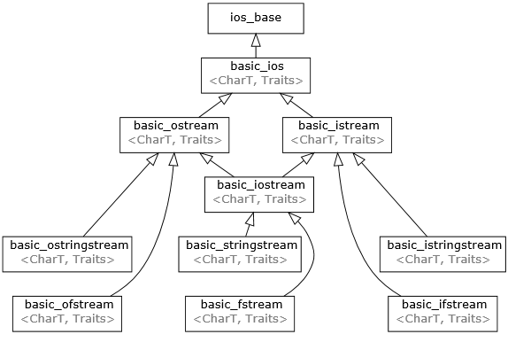

# Lecture 4: Streams

## Streams

A simple definition: a general input/output (IO) abstraction for C++. Abstractions provide a consistent interface, and in the case of streams the interface is for reading and writing data.  

```cpp
int main() {
    double pi;
    std::cin >> pi;
    std::cout << pi / 2 << '\n';
    return 0;
}
```

- `std::cout` stream is an instance of `std::ostream` which represents the standard output stream. 
- `std::cin` stream is an instance of `std::istream` which represents the standard input stream.  

    <center>
          
        graph 1: Inheritance diagram
    </center>