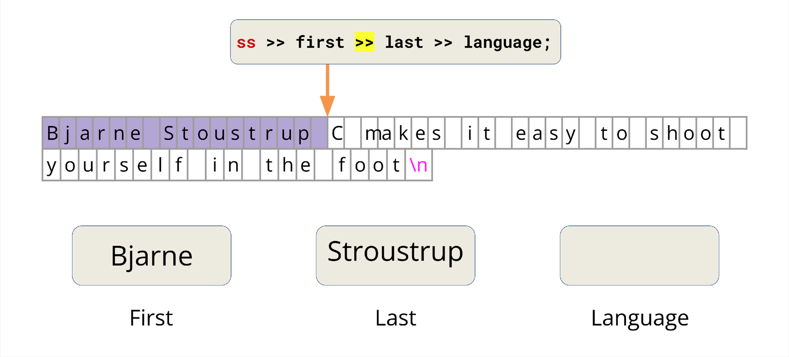

# Lecture 4: Streams

## Streams

A simple definition: a general input/output (IO) abstraction for C++. Abstractions provide a consistent interface, and in the case of streams the interface is for reading and writing data.  

### `iostream`

```cpp
int main() {
    double pi;
    std::cin >> pi;
    std::cout << pi / 2 << '\n';
    return 0;
}
```

- `std::cout` stream is an instance of `std::ostream` which represents the standard output stream. 
- `std::cin` stream is an instance of `std::istream` which represents the standard input stream.  
- `std::cerr` is used to output errors (unbuffered).  
- `std::clog` is used for non-critical event logging (buffered).  

{.center} 
<center>Inheritance Diagram</center>  

Streams allow for a universal way of dealing with external data. We can classify different types of streams as:  

- Input streams (I): a way to read data from a source.
    - Are inherited from `std::ostream`
    - ex. reading in something from the console `std::cin`
    - primary operator: `>>` (the extraction operator)
- Output streams (O): a way to write data to a destination.
    - Are inherited from `std::ostream`
    - ex. writing out something to the console `std::cout`
    - primary operator: `<<` (the insertion operator)

### `std::stringstream`

`std::stringstream` is a way to treat strings as streams, useful for use-cases that deal with mixing data types.  

```cpp
int main() {
    // partial Bjarne quote
    std::string initial_quote = "Bjarne Stroustrup C makes it easy to shoot yourself in the foot";

    // create a stringstream
    std::stringstream ss(initial_quote);    // initialize `stringstream` with string constructor
    // ss << initial_quote;                 // also we can insert the `initial_quote` using `<<`

    // data destinations
    std::string first;
    std::string last;
    std::string language, extracted_quote;

    ss >> first >> last >> language >> extracted_quote;
    std::cout << first << " " << last << "said this: " << language << " " << extracted_quote << std::endl;
}
```

As for `ss >> first >> last >> language >> extracted_quote` in example above, it works like:  

=== "step 0"

    {.center}  
    The `>>` operator will reads until the next whitespace, so the first `>>` will extract `Bjarne` into `first`.  

=== "step 1"

    {.center}  
    The `>>` operator will reads until the next whitespace, so the first `>>` will extract `Bjarne` into `first`.  

=== "step 2"

    {.center}  
    In a similar way, the second `>>` will extract `Stroustrup` into `last`.  

=== "step 3"

    {.center}  
    `C` into `language`.  

=== "step 4"

    {.center}  
    Here we encounter the conflict: we want to extract the rest of `initial_quote`, but `>>` can only extract `makes` rather than `makes it easy to ...`

To tackle the problem, we can use `getline()`, which is defined as:  

```cpp
istream& getline(istream& is, string& str, char delim)
```

- `getline()` reads an input stream `is` up until the `delim` char and stores it in some buffer `str`.
- The delim char is by default `\n`.
- `getline()` will consume the delim character in `str`.  

So we can extract the rest of `initial_quote` by `std::getline()`. The following implement would work as expected.    

```cpp
    ss >> first >> last >> language;
    std::getline(ss, extracted_quote);
    std::cout << first << " " << last << "said this: " << language << " " << extracted_quote << std::endl;
```

### Output streams

As we have defined before, output streams are a way to write data to a destination / external source. To gain a deeper understanding, here's a simple example.  

```cpp
double tao = 6.28;
std::cout << tao;
```

The character in output streams are stored in an intermediary buffer before being flushed to the destination. `std::cout` stream is line-buffered, content in buffer will not be shown on external source until an explict flush occurs.  

```cpp
std::cout << std::flush;
// This works as well
std::cout << std::endl;
```

After this, originally stored in buffer `tao` is flushed into its destination. Another method is to use `std::endl`, it tells the `cout` stream to end the line, furthermore, it also tells the stream to flush.  

```cpp
int main() {
    for (int i = 1; i <= 5; ++i) {
        std::cout << i << std::endl;
    }
    return 0;
}
```

In the example above, focus on the intermediate buffer and output: initially the buffer is empty, and then after the first loop, the buffer will contain two elements `1` and `\n`. Meanwhile, `std::endl` tells the stream to flush, so the buffer is cleared and output `1`. In whole process there occurs 5 flushes.  

However, flushing is an expensive operation, we should try to avoid frequent flushing. C++ is smart to know when to auto flush the buffer. One method is to use `\n` rather than `std::endl`.  

```cpp
int main() {
    for (int i = 1; i <= 5; ++i) {
        std::cout << i << `\n`;
    }
    return 0;
}
```

In this case, the buffer will be filled in with `i` and `\n` until it's full, then C++ will auto flush the buffer. If the buffer can contain 8 elements, executing this code will only flush twice.  

`\n` is more efficient, it is usually a good idea to use `\n` instead of `std::endl`.  

Now let us focus on output file streams. Output file streams have a type `std::ofstream`, it is a way to write data to a file.  

- use the `<<` insertion operator to send to the file  
- there are some methods for `std::ofstream`: `is_open()`, `open()`, `close()`, `fail`, ect. For more, you can refer to [cppreference](https://cplusplus.com/reference/fstream/ofstream/){target="_blank"}.  

```cpp
int main() {
    std::ofstream ofs("hello.txt");
    if (ofs.is_open()) {
        ofs << "Hello CS106L!" << '\n';
    }
    ofs.close();
    ofs << "this will not get written";
    ofs.open("hello.txt");
    // ofs.open("hello.txt", std::ios::app);    `std::ios::app` is a flag specifies that you want to append, not truncate
    ofs << "this will though! It's open again";
    return 0;
}
```

### Input streams

Input streams have the type `std::istream`, it is a way to read data from an destination / external source. Remember `std::cin` is the console input stream. Now let us focus on `std::cin`.

- `std::cin` is buffered.
- Think of it as a place where a user can store some data and then read from it.  
- `std::cin` buffer stops at a whitespace, which in     C++ includes: 
    - " " (a literal space)
    - \n
    - \t

```cpp
int main() {
    double pi;
    std::cin;
    std::cin >> pi;
    std::cout << "pi is: " << pi << '\n';
    return 0;
}
```

In this case, the buffer is initially empty. The first `std::cin` will do nothing to buffer, because cin buffer is empty so prompts for input. The second `std::cin >> pi` reads up to white space and saves input to `double pi` in buffer.  

```cpp
void cinGetlineBugFixed() {
    double pi;
    double tao;
    std::string name;
    std::cin >> pi;
    std::getline(std::cin, name);
    std::getline(std::cin, name);
    std::cin >> tao;
    std::cout << "my name is : " << name << " tao is : " << tao << " pi is : " << pi << '\n';
}
```

This case maybe looks kind of strange. Supoose our input is `3.14\nFabio Ibanez\n6.28\n`, `std::cin >> pi` reads up to `3.14`, the first `getline()` reads `\n`, and the next `getline()` reads `Fabio Ibanez\n`, `std::cin >> tao` reads `6.28`. This shows the difference in how they parse data. `std::cin()` leaves the newline in the buffer, `getline()` gets rid of the newline.    

So you should avoid using `getline()` and `std::cin()` together.

Also we have input file streams. Input and output streams on the same source / destination type are complimentary.  

```cpp
int inputFileStreamExample() {
    std::ifstream ifs(“append.txt”);
    if (ifs.is_open()) {
        std::string line;
        std::getline(ifs, line);
        std::cout << “Read from the file: “ << line << ‘\n’;
    }
    if (ifs.is_open()) {
        std::string lineTwo;
        std::getline(ifs, lineTwo);
        std::cout << “Read from the file: “ << lineTwo << ‘\n’;
    }
    return 0;
}
```