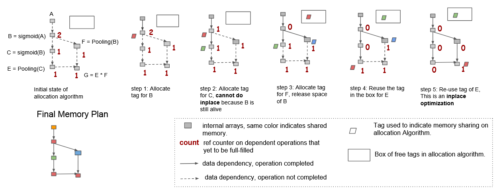
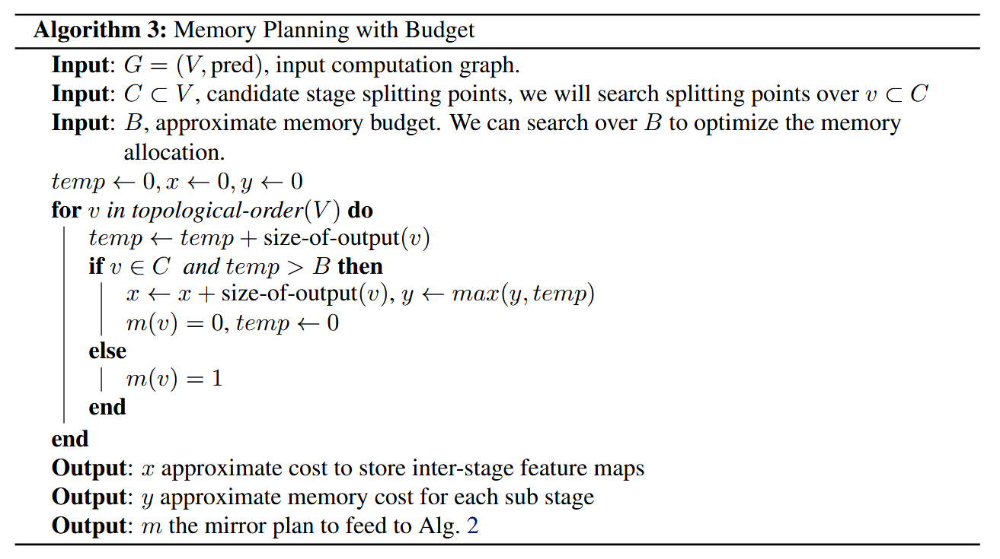

# Training Deep Nets with Sublinear Memory Cost

## Abstract

这篇文章的核心工作在于提出一种系统性方法来降低训练深度神经网络的内存开销。具体来说，作者主要关注降低存储中间结果（特征图）和梯度的内存成本，利用计算图分析 (computation graph analysis) 进行自动原地操作 (automatic in-place operation) 与内存共享优化 (memory sharing optimizations)，更重要的是，设计了一种以计算换内存的方式，得到一个只需少量额外计算成本（每个 batch 额外一次 forward pass 计算）即可将内存开销降低至 $O(\sqrt{N})$、在极端情况下可以降低至 $O(\log N)$ 的训练算法。

## Introduction

由于特征图 (feature maps) 及其梯度 (gradients) 的存储成本随网络深度线性增长，我们研究更深层次模型的能力受到设备（通常是 GPU）内存的限制，从长远来看，理想的机器学习系统应该能从不断增加的数据中持续学习，因此内存高效的算法十分重要。同时，减少内存开销还允许更大的 batch size，以更好地利用设备和 batchwise operators 的稳定性（例如 batch normalization），这有助于改善内存局部性，并可能带来更好的内存访问模式。

大多数现有框架关注于梯度图建立后的图分析计算优化，而较少讨论计算与内存间的权衡。在自动微分技术中，丢弃中间结果的思想也被称作 gradient checkpointing technique，这篇文章将该思想应用到了神经网络梯度图构建当中。

## Memory Optimization with Computation Graph

我们首先简单介绍计算图。（参考：[Open MLsys 4: 计算图](https://openmlsys.github.io/chapter_computational_graph/index.html)）  

计算图 (Computation Graph) 由基本数据结构张量 (Tensor) 和基本运算单元算子构成。在计算图中通常使用节点表示算子，节点间的有向边表示张量状态和计算间的依赖关系。这种依赖关系影响算子的执行顺序与并行情况。在机器学习算法中，计算图是一个有向无环图，即在计算图中造成循环依赖 (Circular Dependency) 的数据流向是不被允许的，这会造成计算逻辑的死循环。因此我们通常以展开 (Unrolling) 表示循环关系，在展开复制计算子图时会给复制的所有张量和运算符赋予新的标识符，区分被复制的原始子图，以避免形成循环依赖。

依赖关系存在传递性，可以简单区分为直接依赖、间接依赖与相互独立。

{.center}  

上图展示了一个 two-layer fully connected neural network 的计算图，此处我们使用粗粒度的操作并隐藏权重节点及梯度来简化图。该图展示了示例的一种分配策略，使用到两种类型的内存优化：  

- 原地操作 (Inplace operation)：直接将输出存储到输入的内存中
- 内存共享 (Memory sharing)：不再需要的中间结果所占用的内存可被回收并在另一个节点中使用

本文采用一种启发式算法对计算图染色，相较于构造冲突图 (conflicting graph) $O(N^2)$ 的复杂度，只需要 $O(N)$ 时间即可完成。具体而言，该算法按拓扑序遍历计算图，并使用计算器记录每个节点的 liveness。当没有其它待处理操作依赖于其输入时可以进行原地操作，当该算法中的回收后的 tag 被其它节点复用时可以进行内存共享。下图展示了算法的细节。

{.center}

由于可以在每个中间结果上启用共享，依赖分析通常可以将 n 层深度网络预测的内存占用从 $O(N)$ 降至接近 $O(1)$。

## Trade Computation for Memory

然而，由于大多数梯度算子依赖于前向传递的中间结果，对一个 n 层的卷积网络或序列长为 n 的 RNN 仍然需要 $O(N)$ 的内存用于存储中间结果。为减小内存占用，本文提出一种丢弃部分中间结果，并在需要时通过额外的前向计算恢复它们的方法。

下图展示了一个用于线性链式前馈神经网络的简化算法。具体来说，神经网络被分为若干个段落 (segment)，该算法只存储每个段落的输出而丢弃所有中间结果，在反向传播期间在段落中重新计算被丢弃的中间结果。因此只需要消耗存储每个段落输出的内存成本，和在每段上进行反向传播的最大内存成本。

{.center}

算法一可以通过指定函数 $m : V \rightarrow N$ 推广至通用计算图。参考下图，其中 $m(v)$ 表示结果可被重新计算的次数，我们称其为 $m$ the mirror function，因为重新计算等价于复制节点。当对段落内的节点有 $m(v) = 1$，对每个段落的输出节点有 $m(v) = 0$ 时该算法等价于算法一。

{.center}

假设我们将 n 层的网络均分为 k 段，训练该网络的内存开销将会是： 

$$cost \text{-} total = \mathop{max}\limits_{i=1,...,k} cost \text{-} of \text{-} segment(i) + O(k) = O(\frac{n}{k}) + O(k)$$

公式中第一部分为各段上反向传播的内存开销，第二部分为存储各个段落输出结果的开销。考虑令 $k = \sqrt{N}$，得到总的开销为 $O(2 \sqrt{N})$。该算法将内存开销降低到 sub-linear，尽管反向传播需要计算两次，但其对总计算时间的速度减慢影响并不十分显著。

在一般情况下各层的存储开销并不一致，本文提出一种方法，即给定各段的预期开销 $B$，利用贪心算法为各段分配内存，通过更改 $B$ 可以调整内存的分配策略。当进行静态内存分配时，可以获得各个分配策略的精确内存成本，利用该信息可对 $B$ 进行启发式搜索，以找到平衡二者的最优策略。

{.center}

通过递归式的将子图视作计算图中的节点，并应用本文的分段策略，计算可得到训练 n 层神经网络，存储 k 个中间结果的内存开销可以降至 $g(n) = k \log_{k+1}{n}$，当 $k = 1$ 时，$g(n) = O(\log_{2}{n})$，尽管受限于具体实现，但该结论表明通过递归可以进一步权衡内存。

一个显然的应用是，我们可以丢弃部分低成本操作并保留耗时的计算结果。例如在 CNN 的 `Conv-BatchNorm-Activation` pipeline 中，我们可以保留卷积的结果，而丢弃 batch normalization, acctivation function 和 pooling 的结果。

## Experiments

实验人员在深度卷积网络和长序列的长短期记忆网络训练任务上，对文中提到的不同策略进行了比较，包括：

- no optimization：直接为每个节点分配内存
- inplace：可能时启用原地操作优化
- sharing：应用原地优化及共享内存
- drop bn-relu：应用所有系统优化，丢弃 bn-relu 的结果
- sublinear plan：应用所有系统优化，应用算法三中的搜索策略

测试表明次线性策略将内存成本减少至原来的三分之一到一半，并带来约 30% 的额外运行时间。

## Conclusion

这篇论文提出了系统性的通过计算图分析减小训练时内存开销的方法，并给出一种用计算换内存的次线性策略。以运行时间为代价，我们在相同内存成本下可以训练更广泛的深度学习模型。本文对递归式算法仅作简单分析，没有进行进一步的实现与测试。